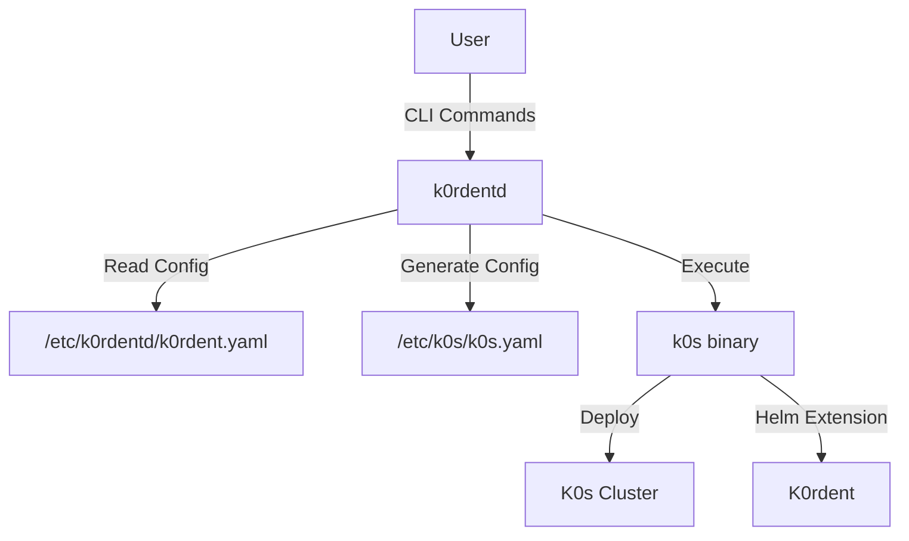
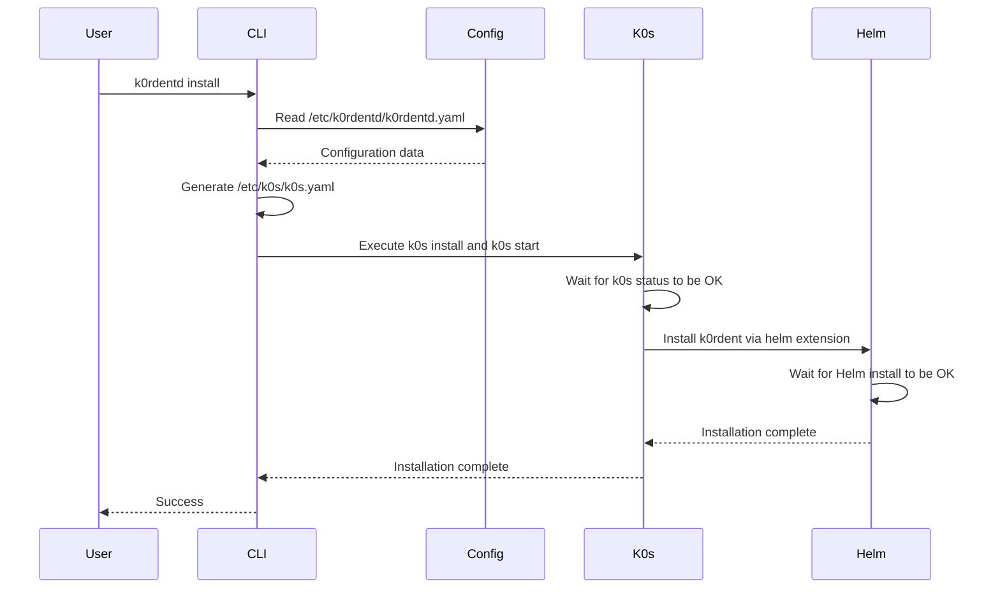

# K0rdentd Architecture

## Overview

K0rdentd is a CLI tool that automates the deployment of K0s and K0rdent on a VM. It follows a similar pattern to RancherD but simplifies the architecture by directly configuring K0s and using its built-in helm extension mechanism.

## System Architecture



## Component Design

### 1. CLI Interface (urfave/cli)

The CLI will support the following commands:
- `k0rdentd install` - Install K0s and K0rdent
- `k0rdentd uninstall` - Uninstall K0s and K0rdent  
- `k0rdentd version` - Show version information
- `k0rdentd config` - Manage configuration

CLI Flags:
- `--config-file` - Path to config file (default: /etc/k0rdentd/k0rdentd.yaml)
- `--debug` - Enable debug logging
- `--dry-run` - Show what would be done without making changes

### 2. Configuration Management

#### k0rdentd.yaml Structure

```yaml
# K0s Configuration
k0s:
  version: "v1.32.4+k0s.0"
  api:
    address: "0.0.0.0"
    port: 6443
  network:
    provider: "calico"
    podCIDR: "10.244.0.0/16"
    serviceCIDR: "10.96.0.0/12"
  storage:
    type: "etcd"
    etcd:
      peerAddress: "127.0.0.1"

# K0rdent Configuration
k0rdent:
  version: "v0.1.0"
  helm:
    chart: "k0rdent/k0rdent"
    namespace: "k0rdent-system"
    values:
      replicaCount: 1
      service:
        type: ClusterIP
        port: 80

# Global Settings
debug: false
logLevel: "info"
```

### 3. K0s Configuration Generator

The tool will:
1. Read the k0rdentd.yaml configuration
2. Generate a K0s-compatible configuration at /etc/k0s/k0s.yaml
3. Include helm extensions for k0rdent installation

Example generated k0s.yaml:
```yaml
apiVersion: k0s.k0sproject.io/v1beta1
kind: Cluster
metadata:
  name: k0s
spec:
  api:
    address: "0.0.0.0"
    port: 6443
  network:
    provider: "calico"
    podCIDR: "10.244.0.0/16"
    serviceCIDR: "10.96.0.0/12"
  storage:
    type: "etcd"
    etcd:
      peerAddress: "127.0.0.1"
  extensions:
    helm:
      repositories:
        - name: k0rdent
          url: https://charts.k0rdent.io
      charts:
        - name: k0rdent
          chartname: k0rdent/k0rdent
          version: "v0.1.0"
          namespace: k0rdent-system
          values: |
            replicaCount: 1
            service:
              type: ClusterIP
              port: 80
```

### 4. Installation Workflow



### 5. Error Handling and Validation

- Validate configuration file structure and values
- Check for required dependencies (k0s binary, helm, etc.)
- Provide meaningful error messages
- Support dry-run mode for testing

### 6. Testing Strategy

#### Unit Tests (ginkgo/gomega)
- Configuration parsing and validation
- K0s configuration generation
- CLI argument handling
- Error scenarios

#### Integration Tests
- End-to-end installation testing
- Configuration compatibility testing
- Upgrade scenarios

## Directory Structure

```
.
├── cmd/
│   └── k0rdentd/
│       └── main.go          # CLI entry point
├── pkg/
│   ├── cli/                # CLI command implementations
│   ├── config/             # Configuration management
│   ├── generator/          # K0s config generation
│   ├── installer/          # Installation logic
│   └── utils/              # Utility functions
├── internal/
│   └── test/               # Test utilities
├── scripts/                # Build and deployment scripts
├── docs/                   # Documentation
├── examples/               # Example configurations
├── go.mod                  # Go module definition
├── go.sum                  # Go dependencies
├── Makefile                # Build automation
└── README.md               # Project documentation
```

## Security Considerations

1. **Input Validation**: All user inputs and configuration values will be validated
2. **Sensitive Data**: No secrets or API keys will be committed to the repository
3. **File Permissions**: Configuration files will have appropriate permissions (600)
4. **Logging**: Sensitive information will not be logged
5. **Dependencies**: Regular dependency updates and vulnerability scanning

## Implementation Phases

1. **Phase 1**: CLI skeleton and configuration parsing
2. **Phase 2**: K0s configuration generation
3. **Phase 3**: Installation workflow
4. **Phase 4**: Testing and validation
5. **Phase 5**: Documentation and examples

## Open Questions

1. Should we support multiple k0rdent versions or only the latest?
3. Should we include health checks and status reporting?
4. What about upgrade scenarios from previous versions?