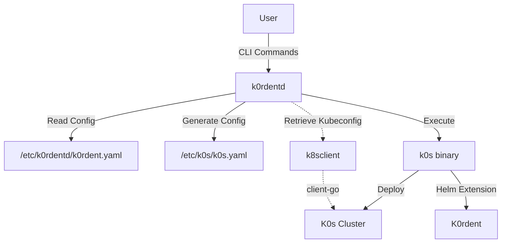
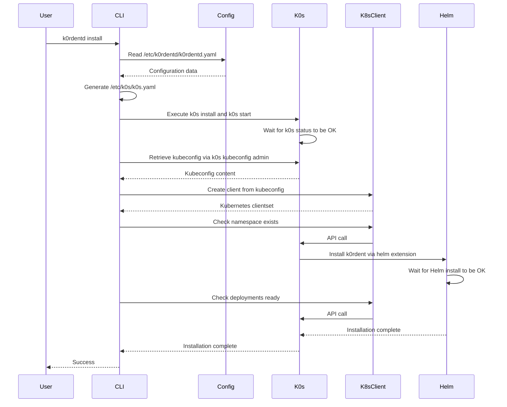
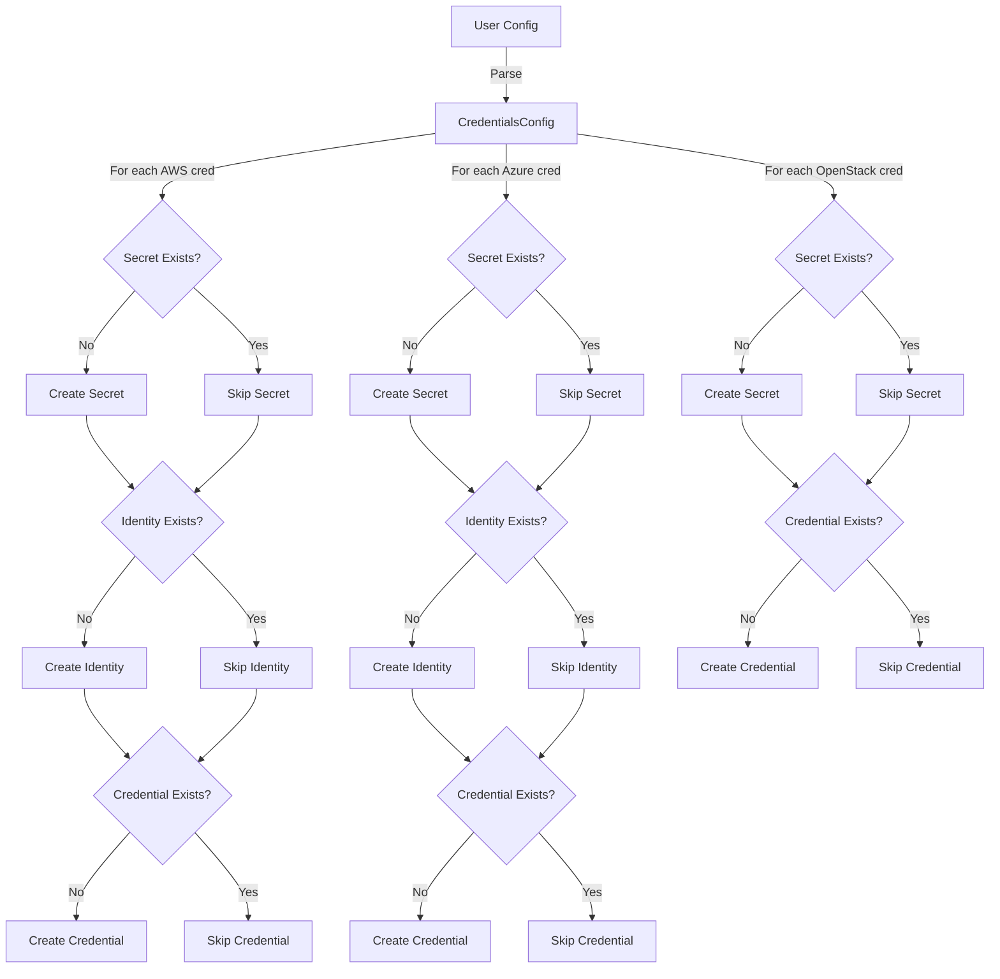

# K0rdentd Architecture

## Overview

K0rdentd is a CLI tool that automates the deployment of K0s and K0rdent on a VM. It follows a similar pattern to RancherD but simplifies the architecture by directly configuring K0s and using its built-in helm extension mechanism.

## System Architecture



## Component Design

### 1. CLI Interface (urfave/cli)

The CLI will support the following commands:
- `k0rdentd install` - Install K0s and K0rdent
- `k0rdentd uninstall` - Uninstall K0s and K0rdent  
- `k0rdentd version` - Show version information
- `k0rdentd config` - Manage configuration

CLI Flags:
- `--config-file` - Path to config file (default: /etc/k0rdentd/k0rdentd.yaml)
- `--debug` - Enable debug logging
- `--dry-run` - Show what would be done without making changes

### 2. Configuration Management

#### k0rdentd.yaml Structure

```yaml
# K0s Configuration
k0s:
  version: "v1.32.4+k0s.0"
  api:
    address: "0.0.0.0"
    port: 6443
  network:
    provider: "calico"
    podCIDR: "10.244.0.0/16"
    serviceCIDR: "10.96.0.0/12"
  storage:
    type: "etcd"
    etcd:
      peerAddress: "127.0.0.1"

# K0rdent Configuration
k0rdent:
  version: "v0.1.0"
  helm:
    chart: "k0rdent/k0rdent"
    namespace: "k0rdent-system"
    values:
      replicaCount: 1
      service:
        type: ClusterIP
        port: 80

# Global Settings
debug: false
logLevel: "info"
```

### 3. K0s Configuration Generator

The tool will:
1. Read the k0rdentd.yaml configuration
2. Generate a K0s-compatible configuration at /etc/k0s/k0s.yaml
3. Include helm extensions for k0rdent installation

Example generated k0s.yaml:
```yaml
apiVersion: k0s.k0sproject.io/v1beta1
kind: Cluster
metadata:
  name: k0s
spec:
  api:
    address: "0.0.0.0"
    port: 6443
  network:
    provider: "calico"
    podCIDR: "10.244.0.0/16"
    serviceCIDR: "10.96.0.0/12"
  storage:
    type: "etcd"
    etcd:
      peerAddress: "127.0.0.1"
  extensions:
    helm:
      repositories:
        - name: k0rdent
          url: https://charts.k0rdent.io
      charts:
        - name: k0rdent
          chartname: k0rdent/k0rdent
          version: "v0.1.0"
          namespace: k0rdent-system
          values: |
            replicaCount: 1
            service:
              type: ClusterIP
              port: 80
```

### 4. Installation Workflow



### 5. Error Handling and Validation

- Validate configuration file structure and values
- Check for required dependencies (k0s binary, helm, etc.)
- Provide meaningful error messages
- Support dry-run mode for testing

### 6. Kubernetes Client Architecture

#### 6.1 K8sClient Package (`pkg/k8sclient`)

The `k8sclient` package provides a Go-native way to interact with the Kubernetes cluster using the official `client-go` library, replacing all `kubectl` exec calls.

**Key Components:**

```go
// Client wraps a Kubernetes clientset with helper methods
type Client struct {
    clientset kubernetes.Interface
    config    *rest.Config
}
```

**Kubeconfig Retrieval:**
- After k0s installation, the admin kubeconfig is retrieved via `k0s kubeconfig admin` command
- The kubeconfig is kept in memory (not written to disk) for security
- A `client-go` clientset is created using `clientcmd.RESTConfigFromKubeConfig()`

**Provided Operations:**
- `NamespaceExists(name string) (bool, error)` - Check if a namespace exists
- `GetDeploymentReadyReplicas(namespace, name string) (int32, error)` - Get deployment ready replica count
- `GetDeploymentReplicas(namespace, name string) (int32, error)` - Get deployment total replica count
- `GetPodPhases(namespace, labelSelector string) ([]corev1.PodPhase, error)` - Get pod phases by label selector
- `PatchServiceType(namespace, name string, svcType corev1.ServiceType) error` - Patch service type
- `GetServiceNodePort(namespace, name string) (int32, error)` - Get service NodePort
- `ApplyIngress(ingress *networkingv1.Ingress) error` - Create or update an ingress
- `GetDeploymentEnvVar(namespace, deployment, container, envVar string) (string, error)` - Extract env var from deployment

**Benefits:**
- Type-safe API operations instead of jsonpath parsing
- Better error handling using `k8s.io/apimachinery/pkg/api/errors`
- No dependency on kubectl binary being available
- Easier to mock for testing using fake clientset

### 6.2 Credentials Package (`pkg/credentials`)

The `credentials` package manages the creation of cloud provider credentials for k0rdent. It creates the necessary Kubernetes objects (Secrets, Identity objects, and k0rdent Credentials) based on user configuration.

**Supported Cloud Providers:**
- **AWS**: Creates Secret, AWSClusterStaticIdentity, and Credential objects
- **Azure**: Creates Secret, AzureClusterIdentity, and Credential objects
- **OpenStack**: Creates Secret and Credential objects (no Identity object needed)

**Idempotent Resource Creation:**

The `credentials` package implements a generic `createIfNotExists` function that provides idempotent resource creation:

```go
// ResourceSpec defines the specification of a resource to be created
type ResourceSpec struct {
    Type      ResourceType
    Namespace string
    Name      string
}

// createIfNotExists checks for resource existence before creation
func (m *Manager) createIfNotExists(
    ctx context.Context,
    spec ResourceSpec,
    existsFn ExistsFunc,
    createFn CreateFunc,
) error
```

**Key Features:**
- **Per-resource checks**: Each resource (Secret, Identity, Credential) is checked individually
- **Skip if exists**: Existing resources are skipped (DEBUG level logging)
- **Reduced API calls**: No unnecessary update operations
- **Partial state recovery**: Can recover from interrupted runs

**Error Handling Strategy:**
- **Best effort approach**: Secret creation failures return errors, but Identity/Credential creation failures only log warnings
- This allows the system to continue even if some resources fail to create

**Credential Creation Flow:**



**Key Components:**

```go
// Manager handles creation of cloud provider credentials
type Manager struct {
    client *k8sclient.Client
}

// NewManager creates a new credentials manager
func NewManager(client *k8sclient.Client) *Manager

// CreateAll creates all configured credentials (idempotent)
func (m *Manager) CreateAll(ctx context.Context, cfg config.CredentialsConfig) error
```

**Security Considerations:**
- All sensitive data is stored in Kubernetes Secrets
- Credential values are never logged
- Credentials are created in the k0rdent namespace (kcm-system)
- Identity objects use `allowedNamespaces` to control access

### 6. Testing Strategy

#### Unit Tests (ginkgo/gomega)
- Configuration parsing and validation
- K0s configuration generation
- CLI argument handling
- Error scenarios
- **K8sClient operations using fake clientset**

#### Integration Tests
- End-to-end installation testing
- Configuration compatibility testing
- Upgrade scenarios

## Directory Structure

```
.
├── cmd/
│   └── k0rdentd/
│       └── main.go          # CLI entry point
├── pkg/
│   ├── cli/                # CLI command implementations
│   ├── config/             # Configuration management
│   ├── generator/          # K0s config generation
│   ├── installer/          # Installation logic
│   ├── credentials/        # Cloud provider credentials management
│   ├── k8sclient/          # Kubernetes client-go wrapper
│   │   ├── client.go       # Core client functionality
│   │   └── k0s.go          # K0s-specific kubeconfig retrieval
│   ├── k0s/                # K0s binary management
│   ├── ui/                 # UI exposure functionality
│   └── utils/              # Utility functions
├── internal/
│   └── test/               # Test utilities
├── scripts/                # Build and deployment scripts
├── docs/                   # Documentation
├── examples/               # Example configurations
├── go.mod                  # Go module definition
├── go.sum                  # Go dependencies
├── Makefile                # Build automation
└── README.md               # Project documentation
```

## Security Considerations

1. **Input Validation**: All user inputs and configuration values will be validated
2. **Sensitive Data**: No secrets or API keys will be committed to the repository
3. **File Permissions**: Configuration files will have appropriate permissions (600)
4. **Logging**: Sensitive information will not be logged
5. **Dependencies**: Regular dependency updates and vulnerability scanning

## Implementation Phases

1. **Phase 1**: CLI skeleton and configuration parsing
2. **Phase 2**: K0s configuration generation
3. **Phase 3**: Installation workflow
4. **Phase 4**: Testing and validation
5. **Phase 5**: Documentation and examples

## Open Questions

1. Should we support multiple k0rdent versions or only the latest?
3. Should we include health checks and status reporting?
4. What about upgrade scenarios from previous versions?