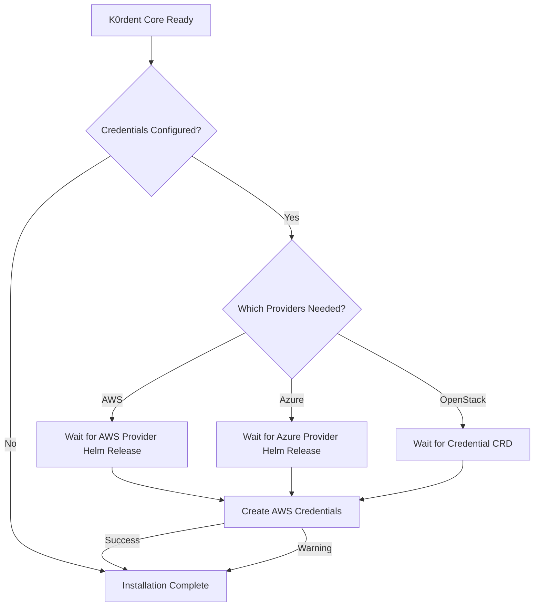

# BUG: Credentials Creation Fails Due to CAPI Providers Not Being Ready

## Problem Description

In the current implementation of the `credentials` feature, there is a timing issue. When a user adds cloud provider credentials (e.g., AWS, Azure, OpenStack) in the `k0rdentd.yaml` configuration file, the program:

1. Creates a Kubernetes Secret with the credential data ✓
2. Attempts to create `AWSClusterStaticIdentity` (or `AzureClusterIdentity`) custom resource ✗
3. Fails because the CRD does not yet exist in the cluster

The root cause is that CAPI (Cluster API) infrastructure providers are not yet installed when the credentials are being created. The current implementation only waits for K0rdent core deployments to be ready, but does not wait for the CAPI infrastructure providers to become available.

## Current Implementation (Buggy)

### Installation Flow

```go
// From pkg/installer/installer.go
func (i *Installer) Install(k0sConfig []byte, k0rdentConfig *config.K0rdentConfig) error {
    // ... existing installation steps ...
    
    // Wait for k0rdent Helm chart to be installed
    if err := i.waitForK0rdentInstalled(); err != nil {
        return fmt.Errorf("k0rdent Helm chart failed to install: %w", err)
    }
    
    // Create credentials if configured
    if k0rdentConfig != nil && k0rdentConfig.Credentials.HasCredentials() {
        if err := i.createCredentials(&k0rdentConfig.Credentials); err != nil {
            return fmt.Errorf("failed to create credentials: %w", err)
        }
    }
    
    return nil
}
```

### Credential Creation Flow

```go
// From pkg/credentials/credentials.go
func (m *Manager) createAWSCredentials(ctx context.Context, cred config.AWSCredential) error {
    // Create Secret with AWS credentials
    secret := &corev1.Secret{...}
    if err := m.client.CreateSecret(ctx, secret); err != nil {
        return fmt.Errorf("failed to create AWS secret: %w", err)
    }
    utils.GetLogger().Infof("✅ Created AWS secret: %s", secretName)

    // Create AWSClusterStaticIdentity - THIS FAILS!
    if err := m.client.CreateAWSClusterStaticIdentity(ctx, identityName, secretName, KCMNamespace); err != nil {
        utils.GetLogger().Warnf("⚠️ Failed to create AWSClusterStaticIdentity %s: %v (Secret was created but Identity creation failed)", identityName, err)
    } else {
        utils.GetLogger().Infof("✅ Created AWSClusterStaticIdentity: %s", identityName)
    }

    // Create k0rdent Credential
    if err := m.client.CreateCredential(ctx, cred.Name, description, "AWSClusterStaticIdentity", identityName, "infrastructure.cluster.x-k8s.io/v1beta2", KCMNamespace); err != nil {
        utils.GetLogger().Warnf("⚠️ Failed to create k0rdent Credential %s: %v (Identity may not exist or creation failed)", cred.Name, err)
    } else {
        utils.GetLogger().Infof("✅ Created k0rdent Credential: %s", cred.Name)
    }

    return nil
}
```

### CRD Creation Attempts

```go
// From pkg/k8sclient/client.go
func (c *Client) CreateAWSClusterStaticIdentity(ctx context.Context, name, secretRef, namespace string) error {
    gvr := schema.GroupVersionResource{
        Group:    "infrastructure.cluster.x-k8s.io",
        Version:  "v1beta2",
        Resource: "awsclusterstaticidentities",
    }
    // ... attempts to create the CR, but CRD doesn't exist yet!
    _, err := c.dynamicClient.Resource(gvr).Namespace(namespace).Create(ctx, identity, metav1.CreateOptions{})
    // Error: no matches for kind "AWSClusterStaticIdentity" in version "infrastructure.cluster.x-k8s.io/v1beta2"
    return err
}
```

## Root Cause Analysis

### What Are CAPI Infrastructure Providers?

Cluster API (CAPI) is a Kubernetes subproject focused on providing declarative APIs and tooling to simplify provisioning, upgrading, and operating multiple Kubernetes clusters. CAPI uses infrastructure providers to manage the lifecycle of infrastructure resources for different cloud platforms.

Each infrastructure provider installs its own set of CRDs (Custom Resource Definitions) into the cluster, including:

#### AWS Provider (CAPA)
- `AWSClusterStaticIdentity` (infrastructure.cluster.x-k8s.io/v1beta2)
- `AWSCluster` (infrastructure.cluster.x-k8s.io/v1beta2)
- `AWSMachine` (infrastructure.cluster.x-k8s.io/v1beta2)
- And many others...

#### Azure Provider (CAPZ)
- `AzureClusterIdentity` (infrastructure.cluster.x-k8s.io/v1beta1)
- `AzureCluster` (infrastructure.cluster.x-k8s.io/v1beta1)
- `AzureMachine` (infrastructure.cluster.x-k8s.io/v1beta1)
- And many others...

#### OpenStack Provider (CAPO)
- Uses standard Kubernetes Secrets for credentials
- No custom Identity CRD needed
- `OpenStackCluster` (infrastructure.cluster.x-k8s.io/v1beta1)
- `OpenStackMachine` (infrastructure.cluster.x-k8s.io/v1beta1)
- And many others...

### Why Are Providers Not Ready?

The current implementation checks if K0rdent core deployments are ready:

```go
// From pkg/installer/installer.go
func (i *Installer) areK0rdentDeploymentsReady() (bool, error) {
    requiredDeployments := []string{
        "k0rdent-cert-manager",
        "k0rdent-cert-manager-cainjector",
        "k0rdent-cert-manager-webhook",
        "k0rdent-datasource-controller-manager",
        "k0rdent-k0rdent-enterprise-controller-manager",
        "k0rdent-k0rdent-ui",
        "k0rdent-rbac-manager",
        "k0rdent-regional-telemetry",
    }
    return i.k8sClient.AreAllDeploymentsReady(ctx, "kcm-system", requiredDeployments)
}
```

However, this does NOT check if CAPI infrastructure providers are installed and ready. The infrastructure providers are typically installed separately by K0rdent after core components are ready, but before the user can create credentials.

## Required CRDs Before Creating Credentials

Based on the credential types configured, the following CRDs must exist in the cluster:

### For AWS Credentials
1. `AWSClusterStaticIdentity.infrastructure.cluster.x-k8s.io/v1beta2` - Required for storing AWS identity references
2. `Credential.k0rdent.mirantis.com/v1beta1` - Required for K0rdent credential management

### For Azure Credentials
1. `AzureClusterIdentity.infrastructure.cluster.x-k8s.io/v1beta1` - Required for storing Azure identity references
2. `Credential.k0rdent.mirantis.com/v1beta1` - Required for K0rdent credential management

### For OpenStack Credentials
1. `Credential.k0rdent.mirantis.com/v1beta1` - Required for K0rdent credential management
2. No Identity CRD needed (uses standard Kubernetes Secret)

## How to Detect Provider Readiness

There are several approaches to determine if CAPI providers are ready:

### Option 1: Check CRD Existence
Check if the required CRDs are installed in the cluster before attempting to create credential resources.

```go
func (c *Client) CRDExists(ctx context.Context, name string) (bool, error) {
    _, err := c.clientset.ApiextensionsV1().CustomResourceDefinitions().Get(ctx, name, metav1.GetOptions{})
    if err != nil {
        if errors.IsNotFound(err) {
            return false, nil
        }
        return false, err
    }
    return true, nil
}
```

### Option 2: Check Provider Deployments
Check if the infrastructure provider deployments are running and ready.

For AWS:
- `capa-controller-manager` deployment in `capi-system` namespace

For Azure:
- `capz-controller-manager` deployment in `capi-system` namespace

For OpenStack:
- `capo-controller-manager` deployment in `capi-system` namespace

### Option 3: Check Provider Helm Releases
Check if the provider Helm releases are deployed successfully. This is the recommended approach as it indicates both CRDs and deployments are ready.

Helm stores release information in Secrets in the namespace where it was installed. The secret name follows the pattern: `sh.helm.release.v1.<releaseName>`. The release status can be determined by parsing the secret's data.

## Proposed Solution

The solution should implement a waiting mechanism that:

1. **Waits for CAPI infrastructure provider Helm releases to be deployed successfully** before creating credential resources
2. **Shows a spinner** to indicate to the user that the program is waiting
3. **Checks only for the providers that are needed** based on the configured credentials
4. **Has a reasonable timeout** to avoid hanging indefinitely
5. **Continues on credential creation failure** - credential creation failures should only log a warning and not stop the installation, allowing users to still see the K0rdent UI and its URLs

### Implementation Flow



### Detailed Implementation Steps

#### Step 1: Add Helm Release Check Method to k8sclient

```go
// File: pkg/k8sclient/client.go

// HelmReleaseStatus represents the status of a Helm release
type HelmReleaseStatus string

const (
    HelmReleaseStatusDeployed  HelmReleaseStatus = "deployed"
    HelmReleaseStatusFailed    HelmReleaseStatus = "failed"
    HelmReleaseStatusPending   HelmReleaseStatus = "pending"
    HelmReleaseStatusUnknown  HelmReleaseStatus = "unknown"
)

// GetHelmReleaseStatus checks the status of a Helm release in the given namespace
func (c *Client) GetHelmReleaseStatus(ctx context.Context, namespace, releaseName string) (HelmReleaseStatus, error) {
    // Helm stores release information in Secrets in the namespace where it was installed
    // The secret name follows the pattern: sh.helm.release.v1.<releaseName>
    secretName := fmt.Sprintf("sh.helm.release.v1.%s", releaseName)
    
    secret, err := c.clientset.CoreV1().Secrets(namespace).Get(ctx, secretName, metav1.GetOptions{})
    if err != nil {
        if errors.IsNotFound(err) {
            return HelmReleaseStatusUnknown, nil
        }
        return HelmReleaseStatusUnknown, fmt.Errorf("failed to get Helm release secret %s/%s: %w", namespace, secretName, err)
    }
    
    // The release status is stored in the secret's data
    if statusData, ok := secret.Data["status"]; ok {
        // Parse the status to determine if it's deployed
        statusStr := string(statusData)
        if strings.Contains(statusStr, "STATUS: deployed") {
            return HelmReleaseStatusDeployed, nil
        } else if strings.Contains(statusStr, "STATUS: failed") {
            return HelmReleaseStatusFailed, nil
        } else if strings.Contains(statusStr, "STATUS: pending") {
            return HelmReleaseStatusPending, nil
        }
    }
    
    return HelmReleaseStatusUnknown, nil
}

// IsHelmReleaseReady checks if a Helm release is deployed successfully
func (c *Client) IsHelmReleaseReady(ctx context.Context, namespace, releaseName string) (bool, error) {
    status, err := c.GetHelmReleaseStatus(ctx, namespace, releaseName)
    if err != nil {
        return false, err
    }
    return status == HelmReleaseStatusDeployed, nil
}
```

#### Step 2: Add Provider Helm Release Waiting Logic to Installer

```go
// File: pkg/installer/installer.go

// waitForCAPIProviderHelmReleases waits for required CAPI infrastructure provider Helm releases to be deployed
func (i *Installer) waitForCAPIProviderHelmReleases(credsConfig *config.CredentialsConfig) error {
    ctx := context.Background()
    
    // Determine which providers are needed
    providersNeeded := i.getRequiredProviders(credsConfig)
    
    if len(providersNeeded) == 0 {
        utils.GetLogger().Debug("No CAPI providers needed")
        return nil
    }
    
    return i.waitForWithSpinner(
        15*time.Minute,
        "Waiting for CAPI infrastructure providers to be deployed",
        func() (bool, error) {
            // Check if capi-system namespace exists
            exists, err := i.k8sClient.NamespaceExists(ctx, "capi-system")
            if err != nil {
                utils.GetLogger().Debugf("capi-system namespace check failed: %v", err)
                return false, nil
            }
            if !exists {
                utils.GetLogger().Debug("capi-system namespace does not exist yet")
                return false, nil
            }
            
            // Check if all required provider Helm releases are deployed
            for _, provider := range providersNeeded {
                releaseName := fmt.Sprintf("%s-provider", provider)
                ready, err := i.k8sClient.IsHelmReleaseReady(ctx, "capi-system", releaseName)
                if err != nil {
                    utils.GetLogger().Debugf("Provider %s Helm release check failed: %v", provider, err)
                    return false, nil
                }
                if !ready {
                    utils.GetLogger().Debugf("Provider %s Helm release is not ready yet", provider)
                    return false, nil
                }
                utils.GetLogger().Debugf("Provider %s Helm release is deployed", provider)
            }
            
            utils.GetLogger().Info("All required CAPI infrastructure provider Helm releases are deployed")
            return true, nil
        },
    )
}

// getRequiredProviders returns a list of provider types that are needed based on credentials config
func (i *Installer) getRequiredProviders(credsConfig *config.CredentialsConfig) []string {
    providers := make(map[string]bool)
    
    if len(credsConfig.AWS) > 0 {
        providers["capa"] = true
    }
    if len(credsConfig.Azure) > 0 {
        providers["capz"] = true
    }
    if len(credsConfig.OpenStack) > 0 {
        // OpenStack doesn't need a provider for credentials, but we might want to wait for it
        // providers["capo"] = true
    }
    
    result := make([]string, 0, len(providers))
    for provider := range providers {
        result = append(result, provider)
    }
    
    return result
}
```

#### Step 3: Update Install Flow to Wait for Provider Helm Releases

```go
// File: pkg/installer/installer.go

func (i *Installer) Install(k0sConfig []byte, k0rdentConfig *config.K0rdentConfig) error {
    // ... existing installation steps ...
    
    // Wait for k0rdent Helm chart to be installed
    if err := i.waitForK0rdentInstalled(); err != nil {
        return fmt.Errorf("k0rdent Helm chart failed to install: %w", err)
    }
    
    // NEW: Wait for CAPI provider Helm releases if credentials are configured
    if k0rdentConfig != nil && k0rdentConfig.Credentials.HasCredentials() {
        if err := i.waitForCAPIProviderHelmReleases(&k0rdentConfig.Credentials); err != nil {
            // Log warning but continue - credential creation will also warn
            utils.GetLogger().Warnf("⚠️ CAPI infrastructure providers failed to become ready: %v. Will attempt credential creation anyway.", err)
        }
    }
    
    // Create credentials if configured - log warnings on failure but don't fail the installation
    if k0rdentConfig != nil && k0rdentConfig.Credentials.HasCredentials() {
        if err := i.createCredentials(&k0rdentConfig.Credentials); err != nil {
            // Log warning but continue - user can still access K0rdent UI
            utils.GetLogger().Warnf("⚠️ Failed to create credentials: %v. You may need to create them manually through the K0rdent UI.", err)
        }
    }
    
    return nil
}
```

#### Step 4: Update Credential Creation to Log Warnings Instead of Errors

The credential creation code already logs warnings when Identity or Credential creation fails (see lines 52 and 59 in the Current Implementation section). This behavior is correct and should be maintained. The key change is in the installer's `Install` function (Step 3) where credential creation failures should not stop the installation.

Current implementation in `pkg/credentials/credentials.go` already handles this correctly:
- Line 52: Logs warning when AWSClusterStaticIdentity creation fails
- Line 59: Logs warning when k0rdent Credential creation fails
- Function returns `nil` instead of error, allowing the installation to continue

This means no changes are needed to the credential creation code itself - only the installer's error handling needs to be updated as shown in Step 3.

## Recommended Approach

I recommend using **Helm Release Status Check** as the primary approach:

1. **Primary Check**: Verify that provider Helm releases are deployed successfully (indicates both CRDs and deployments are ready)
2. **Timeout**: Use a reasonable timeout (15-20 minutes) to avoid hanging
3. **Spinner**: Show a spinner to indicate progress to the user
4. **Continue on Failure**: Log warnings but don't fail the installation - users can still access K0rdent UI
5. **Logging**: Use appropriate log levels (DEBUG for checks, INFO for success, WARN for issues)

This approach provides:
- ✅ Simplicity (single check covers both CRDs and deployments)
- ✅ Reliability (Helm release status indicates successful installation)
- ✅ User experience (spinner shows progress, installation continues even if credentials fail)
- ✅ Error handling (timeout prevents hanging, warnings allow manual credential creation)

## Testing Considerations

### Unit Tests
1. Mock Helm release status checks
2. Test timeout scenarios
3. Test partial provider readiness (some ready, some not)
4. Test credential creation failure handling (should log warnings, not fail)

### Integration Tests
1. Test with actual K0s/K0rdent installation
2. Verify credentials are created successfully after providers are ready
3. Test with different provider combinations (AWS only, Azure only, both, etc.)
4. Test timeout behavior when providers never become ready
5. Verify that K0rdent UI is accessible even when credential creation fails

## Logging Requirements

Per the project logging standards using `sirupsen/logrus`:

- **DEBUG**: Log each check iteration, including Helm release status
- **INFO**: Log when providers are confirmed ready and when credentials are created successfully
- **WARN**: Log if any check fails unexpectedly, if timeout is approaching, or if credential creation fails
- **ERROR**: Log if timeout occurs or if critical errors prevent credential creation

## References

- Cluster API documentation: https://cluster-api.sigs.k8s.io/
- AWS Provider (CAPA): https://github.com/kubernetes-sigs/cluster-api-provider-aws
- Azure Provider (CAPZ): https://github.com/kubernetes-sigs/cluster-api-provider-azure
- OpenStack Provider (CAPO): https://github.com/kubernetes-sigs/cluster-api-provider-openstack
- K0rdent documentation: https://docs.k0rdent.io/
- Current implementation: pkg/installer/installer.go, pkg/credentials/credentials.go, pkg/k8sclient/client.go
- Project logging standards: AGENTS.md
