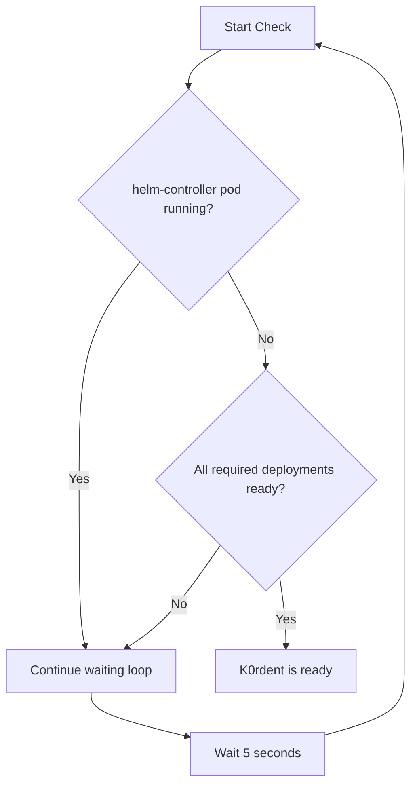

# BUG: After K0rdent is installed, checking for the pods is wrong
- Currently, the code checks for any pods in the `kcm-system` namespace and if all the pods are running, it supposes that K0rdent is ready. However, this is not good. Because there is a `helm-controller-xxx` that runs at the beginning of the installation which just installs the `k0rdent` helm chart. There is a high probability that `k0rdentd` will consider `k0rdent` as installed because that helm job is running, whereas, in reality it is not even installed yet.
- The flow should be as follows:
  - `k0rdentd` checks if a `helm-controller-xxx` pod is running, if it is, then continue the waiting loop.
  - if there is no `helm-controller-xxx` pod running, check if the following deployments are ready:
    - k0rdent-cert-manager
    - k0rdent-cert-manager-cainjector                 
    - k0rdent-cert-manager-webhook                    
    - k0rdent-datasource-controller-manager          
    - k0rdent-k0rdent-enterprise-controller-manager 
    - k0rdent-k0rdent-ui                           
    - k0rdent-rbac-manager                        
    - k0rdent-regional-telemetry
  - if all deployments are ready, then `k0rdent` can be considered installed and ready.                

## Current Implementation (Buggy)

```go
// waitForK0rdentInstalled waits for the k0rdent Helm chart to be installed
func (i *Installer) waitForK0rdentInstalled() error {
	return i.waitForWithSpinner(
		5*time.Minute,
		"Waiting for K0rdent to become ready",
		func() (bool, error) {
			// Check if kcm-system namespace exists
			cmd := exec.Command("k0s", "kubectl", "get", "namespaces", "kcm-system", "-o", "jsonpath='{.status.phase}'")
			_, err := cmd.Output()
			if err != nil {
				utils.GetLogger().Debugf("kcm-system namespace check failed: %v", err)
				return false, nil
			}

			// Check if all required pods are running
			podsCmd := exec.Command("k0s", "kubectl", "get", "pods", "-n", "kcm-system", "-o", "jsonpath='{.items[*].status.phase}'")
			podsOutput, podsErr := podsCmd.Output()
			if podsErr != nil {
				utils.GetLogger().Debugf("k0rdent pods check failed: %v", podsErr)
				return false, nil
			}

			podsStatus := string(podsOutput)
			// Check if all pods are Running
			return strings.Contains(podsStatus, "Running") && !strings.Contains(podsStatus, "Pending") && !strings.Contains(podsStatus, "Error"), nil
		},
	)
}
```

## Proposed Fix

The fix should implement a two-phase check:

### Phase 1: Check for Helm Controller
- Check if any `helm-controller-xxx` pod is running in the `kcm-system` namespace
- If a helm-controller pod exists and is running, continue the waiting loop (K0rdent is still being installed)
- Use kubectl command: `k0s kubectl get pods -n kcm-system -l app=helm-controller -o jsonpath='{.items[*].metadata.name}'`

### Phase 2: Check Required Deployments
- If no helm-controller pod is running, verify that all required K0rdent deployments are ready
- Check the following deployments in the `kcm-system` namespace:
  1. `k0rdent-cert-manager`
  2. `k0rdent-cert-manager-cainjector`
  3. `k0rdent-cert-manager-webhook`
  4. `k0rdent-datasource-controller-manager`
  5. `k0rdent-k0rdent-enterprise-controller-manager`
  6. `k0rdent-k0rdent-ui`
  7. `k0rdent-rbac-manager`
  8. `k0rdent-regional-telemetry`

- For each deployment, check if:
  - The deployment exists
  - `readyReplicas` equals `replicas` (all pods are ready)
  - Use kubectl command: `k0s kubectl get deployment <name> -n kcm-system -o jsonpath='{.status.readyReplicas}/{.status.replicas}'`

### Implementation Flow



## Code Changes Required

### File: `pkg/installer/installer.go`

1. **Add helper function** `isHelmControllerRunning()`:
   - Check if any pod with label `app=helm-controller` exists in `kcm-system` namespace
   - Return true if running, false otherwise

2. **Add helper function** `areK0rdentDeploymentsReady()`:
   - Define list of required deployment names
   - Iterate through each deployment and check ready status
   - Return true only if ALL deployments are ready

3. **Modify** `waitForK0rdentInstalled()`:
   - Replace the simple pod status check with the two-phase logic
   - First check for helm-controller, then check deployments
   - Add appropriate debug logging for each phase

## Testing Considerations

1. **Unit Tests**: Mock kubectl commands to test both scenarios:
   - Helm controller running → should return false
   - No helm controller + all deployments ready → should return true
   - No helm controller + some deployments not ready → should return false

2. **Integration Tests**: Test with actual K0s/K0rdent installation to verify:
   - The check correctly waits during helm chart installation
   - The check passes only when all components are truly ready

## Logging Requirements

Per the project logging standards using `sirupsen/logrus`:

- **DEBUG**: Log each check iteration, including helm-controller status and individual deployment readiness
- **INFO**: Log when K0rdent is confirmed ready
- **WARN**: Log if any deployment check fails unexpectedly

## Example Fixed Implementation

```go
// waitForK0rdentInstalled waits for the k0rdent Helm chart to be installed
func (i *Installer) waitForK0rdentInstalled() error {
	return i.waitForWithSpinner(
		5*time.Minute,
		"Waiting for K0rdent to become ready",
		func() (bool, error) {
			// Check if kcm-system namespace exists
			cmd := exec.Command("k0s", "kubectl", "get", "namespaces", "kcm-system", "-o", "jsonpath='{.status.phase}'")
			_, err := cmd.Output()
			if err != nil {
				utils.GetLogger().Debugf("kcm-system namespace check failed: %v", err)
				return false, nil
			}

			// Phase 1: Check if helm-controller is still running
			helmControllerRunning, err := i.isHelmControllerRunning()
			if err != nil {
				utils.GetLogger().Warnf("helm-controller check failed: %v", err)
				return false, nil
			}
			if helmControllerRunning {
				utils.GetLogger().Debug("helm-controller is still running, waiting for K0rdent installation to complete")
				return false, nil
			}

			// Phase 2: Check if all required deployments are ready
			allReady, err := i.areK0rdentDeploymentsReady()
			if err != nil {
				utils.GetLogger().Warnf("deployment readiness check failed: %v", err)
				return false, nil
			}

			if allReady {
				utils.GetLogger().Info("All K0rdent deployments are ready")
			}

			return allReady, nil
		},
	)
}

// isHelmControllerRunning checks if helm-controller pod is running
func (i *Installer) isHelmControllerRunning() (bool, error) {
	cmd := exec.Command("k0s", "kubectl", "get", "pods", "-n", "kcm-system",
		"-l", "app=helm-controller", "-o", "jsonpath='{.items[*].status.phase}'")
	output, err := cmd.Output()
	if err != nil {
		// If no pods found, that's fine - helm-controller is not running
		return false, nil
	}
	
	phases := string(output)
	// If any pod is in Running phase, helm-controller is still active
	return strings.Contains(phases, "Running"), nil
}

// areK0rdentDeploymentsReady checks if all required K0rdent deployments are ready
func (i *Installer) areK0rdentDeploymentsReady() (bool, error) {
	requiredDeployments := []string{
		"k0rdent-cert-manager",
		"k0rdent-cert-manager-cainjector",
		"k0rdent-cert-manager-webhook",
		"k0rdent-datasource-controller-manager",
		"k0rdent-k0rdent-enterprise-controller-manager",
		"k0rdent-k0rdent-ui",
		"k0rdent-rbac-manager",
		"k0rdent-regional-telemetry",
	}

	for _, deployment := range requiredDeployments {
		cmd := exec.Command("k0s", "kubectl", "get", "deployment", deployment,
			"-n", "kcm-system", "-o", "jsonpath='{.status.readyReplicas}/{.status.replicas}'")
		output, err := cmd.Output()
		if err != nil {
			utils.GetLogger().Debugf("Deployment %s not found or not ready yet", deployment)
			return false, nil
		}

		status := string(output)
		parts := strings.Split(status, "/")
		if len(parts) != 2 {
			utils.GetLogger().Debugf("Unexpected status format for deployment %s: %s", deployment, status)
			return false, nil
		}

		if parts[0] != parts[1] {
			utils.GetLogger().Debugf("Deployment %s not ready: %s", deployment, status)
			return false, nil
		}
	}

	return true, nil
}
```

## References

- Original bug report: [docs/BUG_K0rdent_install_check_wrong.md](docs/BUG_K0rdent_install_check_wrong.md)
- Current implementation: [pkg/installer/installer.go](pkg/installer/installer.go:232)
- Project logging standards: [AGENTS.md](AGENTS.md)
