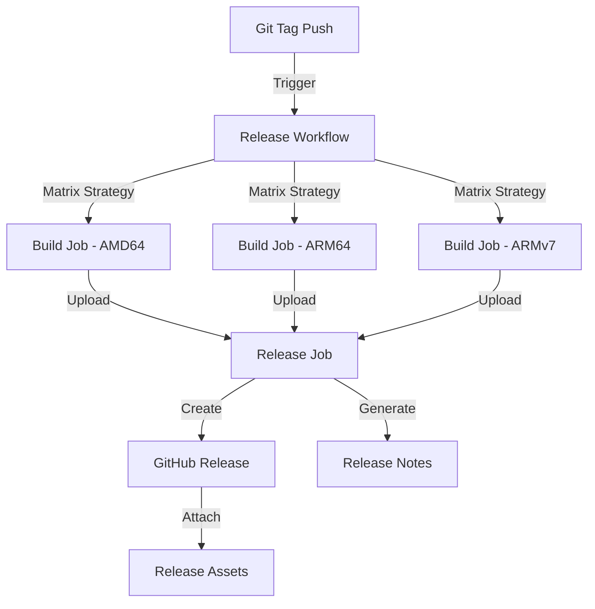

# FEATURE: A Release GitHub action to release the project on GitHub

## Feature Description

`K0rdentd` is a CLI tool which deploys `k0s` and `k0rdent` on a VM. The project is already present in GitHub under `belgaied2/k0rdentd`. The idea is to have a GitHub actions that triggers a build, release and asset upload for each git tag that is pushed to GitHub.
- The GH action should be triggered whenever a new tag is pushed to GitHub.
- The GH action should build the code, and integrate the tag into the binary for reference when using the command `k0rdentd version`
- `k0rdentd` should be built for the linux platforms on AMD64, ARM64 and ARM. 
- The binary created with the build should be `k0rdentd`. However, the asset that is published to Github should be an archive which references, in the filename, the architecture for which the binary was built.
- The GH release page should use a template with sections such as `New Features` (potentially extracted from PRs with `feature` label), `Bug Fixes` (potentially extracted from PRs with `bug` label).

## Architecture Considerations

### Workflow Architecture



### Key Components

#### 1. Trigger Strategy
- **Event**: `push` with tags matching pattern `v*`
- **Pattern**: `v[0-9]+.[0-9]+.[0-9]+*` (semantic versioning)
- **Protection**: Require signed tags for production releases

#### 2. Build Matrix Strategy
- Use GitHub Actions matrix to parallelize builds across architectures
- Each architecture builds independently to reduce total build time
- Matrix configuration:
  - `GOOS`: linux (fixed)
  - `GOARCH`: amd64, arm64, arm

#### 3. Version Injection
- Use Go build flags to inject version at compile time
- Build command: `go build -ldflags "-X github.com/belgaied2/k0rdentd/pkg/cli.Version=${{ github.ref_name }}"`
- Modify `pkg/cli/version.go` to use a package-level variable instead of `c.App.Version`
- The version variable will be set at build time and displayed by the `k0rdentd version` command

#### 4. Artifact Packaging
- Archive format: `.tar.gz` for Linux platforms
- Naming convention: `k0rdentd-${VERSION}-${GOOS}-${GOARCH}.tar.gz`
- Include checksum files (SHA256) for each artifact
- Archive contents:
  - `k0rdentd` binary
  - `LICENSE` file
  - `README.md` (with quick start instructions)

#### 5. Release Notes Generation
- Use GitHub API to query merged PRs since last release
- Categorize PRs by labels:
  - `feature` → New Features section
  - `bug` → Bug Fixes section
  - `enhancement` → Improvements section
  - `breaking` → Breaking Changes section
- Include commit changelog for traceability

### Security Considerations

#### 1. Workflow Permissions
- Use minimal required permissions (principle of least privilege)
- Required permissions:
  - `contents: write` (for creating releases)
  - `packages: write` (if publishing to GHCR)

#### 2. Artifact Integrity
- Generate SHA256 checksums for all artifacts
- Sign releases with GPG (optional but recommended)
- Use GitHub's attestation API for build provenance

#### 3. Secret Management
- No secrets required for basic release workflow
- If signing is implemented, use GitHub Secrets for GPG keys
- Use GitHub Environments for production release approvals

### Best Practices

#### 1. Workflow Structure
```yaml
# Recommended workflow structure
name: Release

on:
  push:
    tags:
      - 'v*'

permissions:
  contents: write

jobs:
  build:
    strategy:
      matrix:
        include:
          - goarch: amd64
          - goarch: arm64
          - goarch: arm
    runs-on: ubuntu-latest
    steps:
      # Build steps

  release:
    needs: build
    runs-on: ubuntu-latest
    steps:
      # Release creation steps
```

#### 2. Build Optimization
- Use `actions/setup-go` with caching enabled
- Use `actions/cache` for Go module caching
- Enable Go build cache between workflow runs

#### 3. Release Drafting
- Create draft releases first for review
- Auto-publish after manual approval (using GitHub Environments)
- Support pre-release tags (e.g., `v1.0.0-rc1`)

#### 4. Version Validation
- Validate tag follows semantic versioning before building
- Fail fast if version format is invalid
- Ensure version in code matches git tag

#### 5. Testing Integration
- Run unit tests before building releases
- Include integration tests if available
- Block release on test failures

### Implementation Details

#### File Structure
```
.github/
└── workflows/
    └── release.yaml      # Main release workflow
```

#### Required Changes to Codebase

1. **Modify `pkg/cli/version.go`**: Update to use a package-level `Version` variable that can be set at build time via ldflags
2. **Build Script**: Create `scripts/build.sh` for local reproducible builds
3. **LDFlags Configuration**: Update build process to inject version via `-ldflags`

#### Modified Version Command
Update `pkg/cli/version.go` to support build-time version injection:

```go
package cli

import (
	"github.com/belgaied2/k0rdentd/pkg/utils"
	"github.com/urfave/cli/v2"
)

// Version is set at build time via ldflags
var Version = "dev"

var VersionCommand = &cli.Command{
	Name:      "version",
	Aliases:   []string{"v"},
	Usage:     "Show version information",
	UsageText: "k0rdentd version",
	Action:    versionAction,
}

func versionAction(c *cli.Context) error {
	utils.GetLogger().Infof("k0rdentd version %s", Version)
	utils.GetLogger().Info("A CLI tool to deploy K0s and K0rdent")
	utils.GetLogger().Info("Copyright © 2024 belgaied2")
	return nil
}
```

**Note**: The hardcoded version in `cmd/k0rdentd/main.go` (`Version: "0.1.0"`) should be removed or set to a placeholder, as the actual version will be injected at build time.

### Error Handling & Rollback

1. **Build Failures**: Matrix strategy isolates failures to specific architectures
2. **Partial Releases**: Delete incomplete releases if any architecture fails
3. **Retry Logic**: Use GitHub Actions retry mechanism for transient failures
4. **Manual Rollback**: Document procedure for deleting releases and re-tagging

### Monitoring & Observability

1. **Notifications**: Send Slack/Discord notifications on release completion/failure
2. **Metrics**: Track build duration and success rates
3. **Audit Log**: All release actions logged in GitHub Actions history

### Future Enhancements

1. **Container Images**: Build and push Docker images to GHCR
2. **Homebrew Tap**: Automate Homebrew formula updates
3. **SBOM Generation**: Generate Software Bill of Materials for compliance
4. **Code Signing**: Implement GPG signing for binary verification
5. **Release Candidates**: Automated RC releases on specific branch patterns

## References

- [GitHub Actions Workflow Syntax](https://docs.github.com/en/actions/using-workflows/workflow-syntax-for-github-actions)
- [Go Releaser](https://goreleaser.com/) - Alternative tool for Go releases
- [Semantic Versioning](https://semver.org/)
- [GitHub Release API](https://docs.github.com/en/rest/releases/releases)

