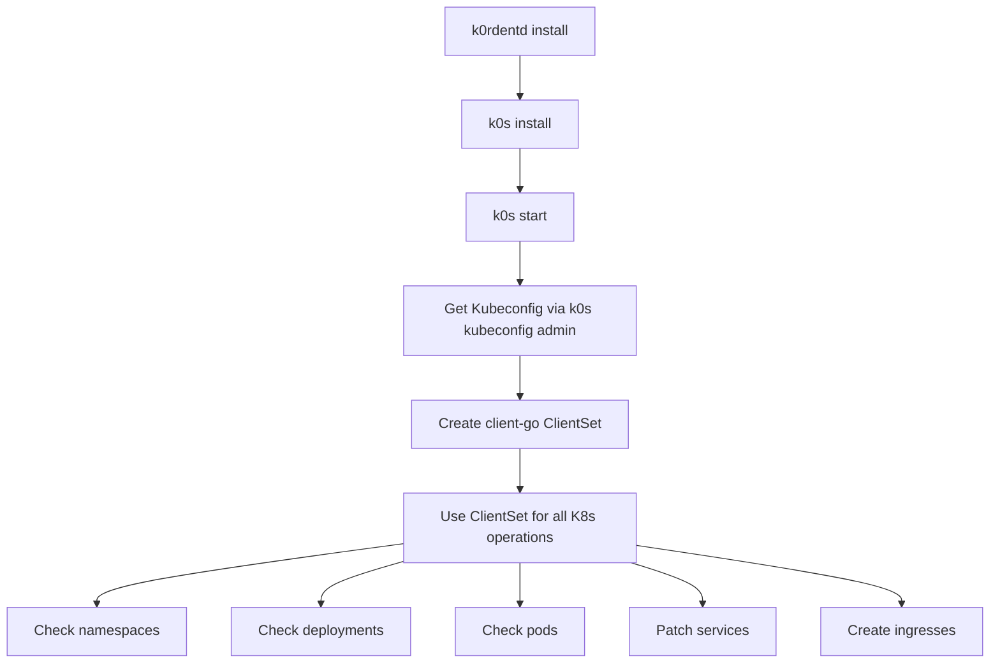

# FEATURE: Switch to client-go instead of running `sudo k0s kubectl`

## Feature description
Until now, `k0rdentd` used commands that are available in the VM once `k0s` installed, in order to query the `k0s` cluster. However, `k0s` has a command `sudo k0s kubeconfig admin` that gets the content of a Kubeconfig file that can be used to access the cluster. Implement using that KUBECONFIG instead of constantly calling `sudo k0s kubectl`.

## Architecture

### Overview



### New Package: pkg/k8sclient

A new package `pkg/k8sclient` will be created to manage the Kubernetes client lifecycle:

```go
package k8sclient

// Client wraps a Kubernetes clientset and provides helper methods
type Client struct {
    clientset *kubernetes.Clientset
    config    *rest.Config
}

// NewFromK0s creates a new Client by retrieving kubeconfig from k0s
func NewFromK0s() (*Client, error)

// NewFromKubeconfig creates a new Client from kubeconfig bytes
func NewFromKubeconfig(kubeconfig []byte) (*Client, error)

// Methods to replace kubectl calls:
// - NamespaceExists(name string) (bool, error)
// - GetDeploymentReadyReplicas(namespace, name string) (int32, error)
// - GetDeploymentReplicas(namespace, name string) (int32, error)
// - GetPodPhases(namespace, labelSelector string) ([]string, error)
// - PatchServiceType(namespace, name, svcType string) error
// - GetServiceNodePort(namespace, name string) (int32, error)
// - ApplyIngress(ingress *networkingv1.Ingress) error
// - GetDeploymentEnvVar(namespace, deploymentName, containerName, envVarName string) (string, error)
```

### Key Design Decisions

1. **Kubeconfig Retrieval**: Use `k0s kubeconfig admin` command to get the admin kubeconfig after k0s is started. This kubeconfig is stored in memory (not written to disk) for security.

2. **Client Initialization**: Use `clientcmd.RESTConfigFromKubeConfig()` to create a REST config from the in-memory kubeconfig bytes, then create a `kubernetes.Clientset`.

3. **Lazy Initialization**: The client is created once after k0s start and reused for all subsequent operations.

4. **Error Handling**: All kubectl-specific error handling (e.g., "NotFound" errors) will be translated to proper Go errors using `k8s.io/apimachinery/pkg/api/errors`.

5. **Type Safety**: Instead of parsing jsonpath output from kubectl, we use typed Kubernetes API objects.

### Files to Modify

| File | Current Approach | New Approach |
|------|-----------------|--------------|
| `pkg/installer/installer.go` | `exec.Command("k0s", "kubectl", "get", "namespaces", ...)` | `k8sclient.NamespaceExists()` |
| `pkg/installer/installer.go` | `exec.Command("k0s", "kubectl", "get", "pods", ...)` | `k8sclient.GetPodPhases()` |
| `pkg/installer/installer.go` | `exec.Command("k0s", "kubectl", "get", "deployment", ...)` | `k8sclient.GetDeploymentReadyReplicas()` |
| `pkg/ui/ui.go` | `exec.Command("k0s", "kubectl", "get", "deployment", ...)` | `k8sclient.GetDeploymentReadyReplicas()` |
| `pkg/ui/ui.go` | `exec.Command("k0s", "kubectl", "get", "service", ...)` | `k8sclient.GetServiceNodePort()` |
| `pkg/ui/ui.go` | `exec.Command("k0s", "kubectl", "patch", "svc", ...)` | `k8sclient.PatchServiceType()` |
| `pkg/ui/ui.go` | `exec.Command("k0s", "kubectl", "apply", "-f", ...)` | `k8sclient.ApplyIngress()` |

### Dependencies

The project already has the required dependencies in `go.mod`:
- `k8s.io/client-go v0.35.0`
- `k8s.io/apimachinery v0.35.0`

### Testing Strategy

1. Unit tests for `pkg/k8sclient` using fake clientset from `k8s.io/client-go/kubernetes/fake`
2. Integration tests that verify the client can be created from kubeconfig bytes
3. Mock the k0s command execution for testing `NewFromK0s()`

### Implementation Steps

1. Create `pkg/k8sclient/client.go` with core client functionality
2. Create `pkg/k8sclient/k0s.go` for k0s-specific kubeconfig retrieval
3. Refactor `pkg/installer/installer.go` to use the new client
4. Refactor `pkg/ui/ui.go` to use the new client
5. Write comprehensive unit tests
6. Update documentation

## Workflow

The workflow should be as follows:
- After installing k0s with the `k0s install` and `k0s start` commands, get the KUBECONFIG using `k0s kubeconfig admin` and store it in memory.
- Use its content to create a `client-go` client and do all the operations that were previously done using `k0s kubectl` with that client.
