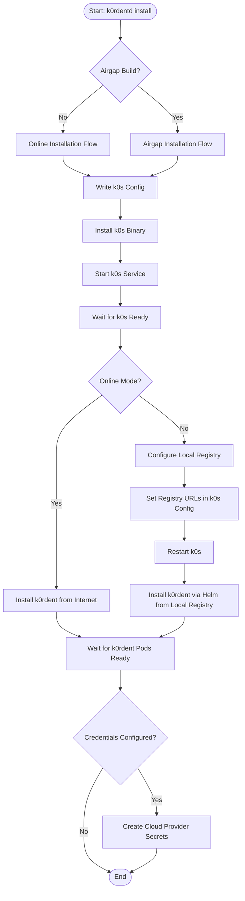
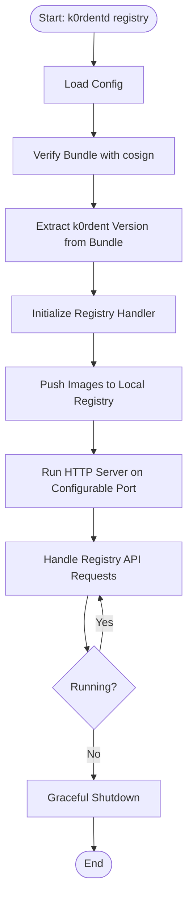
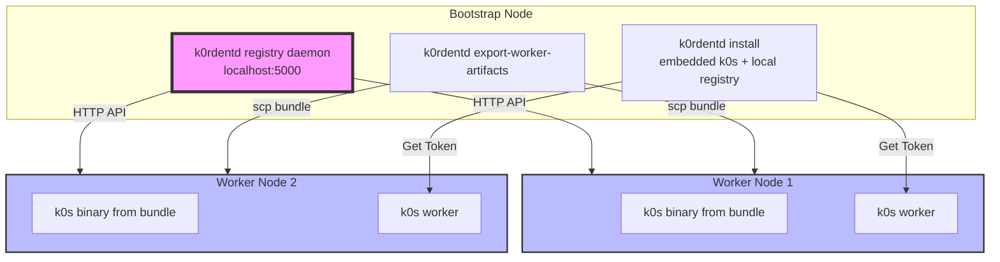

# FEATURE: Air Gapped `k0rdentd install`

## Status: Design Finalized - Option B (External Bundle) with OCI Registry Daemon

## Description

The air-gapped feature enables `k0rdentd` to install k0s and k0rdent in environments without internet access. It creates two build flavors:

1. **Online Flavor** (default): Downloads k0s and k0rdent from internet during install
2. **Air-Gapped Flavor**: Embeds k0s binary; uses external k0rdent bundle (22 GB) from Mirantis

### Key Design Decision: External Bundle (Option B) + Local OCI Registry

**What's Embedded**:
- k0s binary (~100 MB) - embedded directly in k0rdentd-airgap binary

**What's External**:
- k0rdent enterprise airgap bundle (22 GB) - downloaded separately by user

**Local OCI Registry**:
- `k0rdentd registry` command runs as separate daemon
- Disk-based storage for 22GB of images
- Configurable port (default: 5000)
- Accessible to multi-worker clusters
- Uses go-containerregistry/pkg/registry

**Rationale**:
- Avoids redistributing k0rdent enterprise binaries we don't own
- Reduces k0rdentd binary size from ~22GB to ~100MB
- Users download k0rdent bundle directly from authorized Mirantis source
- Legal compliance: we only redistribute open-source k0s binary
- Local registry enables official k0rdent airgap installation process
- Reusable installation steps between online and airgap modes

---

## Architecture Overview

### Component Diagram

```
┌─────────────────────────────────────────────────────────────────────────────┐
│                           Air-Gapped k0rdentd                               │
│                                Binary                                        │
├─────────────────────────────────────────────────────────────────────────────┤
│  ┌──────────────┐  ┌─────────────────────────────────────────────────┐     │
│  │   k0s Binary │  │              Build Metadata                     │     │
│  │   (embedded) │  │  { "flavor": "airgap", "k0sVersion": "v1.32.8", │     │
│  │  ~100 MB     │  │        "buildTime": "2025-01-15T10:00:00Z" }    │     │
│  └──────────────┘  └─────────────────────────────────────────────────┘     │
│                                                                              │
│  External: k0rdent Enterprise Airgap Bundle (22 GB)                          │
│  Source: https://get.mirantis.com/k0rdent-enterprise/VERSION/               │
│  Location: Configured via config file or CLI flag                           │
└─────────────────────────────────────────────────────────────────────────────┘
                                  │
                                  ▼
                    ┌─────────────────────────────┐
                    │   k0rdentd registry daemon   │
                    │   (Separate Process)         │
                    │   Port: 5000 (configurable)  │
                    │   Storage: /var/lib/registry │
                    └─────────────────────────────┘
                                  │
              ┌───────────────────┼───────────────────┐
              ▼                   ▼                   ▼
       ┌──────────────┐   ┌──────────────┐   ┌───────────────┐
       │ Push Images  │   │ Push Charts  │   │  HTTP Server  │
       │ from Bundle  │   │ from Bundle  │   │  (localhost)  │
       └──────────────┘   └──────────────┘   └───────────────┘
                                  │
                                  ▼
                    ┌─────────────────────────────┐
                    │   k0rdentd install          │
                    │   (Air-Gapped Mode)         │
                    └─────────────────────────────┘
                                  │
              ┌───────────────────┼───────────────────┐
              ▼                   ▼                   ▼
       ┌──────────────┐   ┌──────────────┐   ┌───────────────┐
       │  Install k0s │   │  Configure   │   │ Install Helm  │
       │   (embedded) │   │  Registry    │   │   from Local  │
       │              │   │  URLs        │   │   Registry    │
       └──────────────┘   └──────────────┘   └───────────────┘
```

### Installation Flow with Registry Daemon

```
┌──────────────────────────────────────────────────────────────────────────────┐
│                   Complete Air-Gapped Installation Flow                     │
└──────────────────────────────────────────────────────────────────────────────┘

Step 0: Start OCI Registry Daemon (One-time or persistent)
─────────────────────────────────────────────────────────
k0rdentd registry --port 5000 --storage /var/lib/registry

Actions:
1. Start local OCI registry server (go-containerregistry/pkg/registry)
2. Verify bundle with cosign
3. Extract k0rdent version from bundle metadata
4. Push bundle images to local registry (skopeo)
5. Store helm charts for later use
6. Run persistently until stopped


Step 1: Install k0s from Embedded Binary
────────────────────────────────────────
k0rdentd install --airgap

Actions:
1. Detect airgap build flavor
2. Extract k0s binary from embedded assets
3. Install k0s to /usr/local/bin/k0s
4. Generate k0s config from /etc/k0rdentd/k0rdentd.yaml
5. Run: k0s install controller --enable-worker


Step 2: Wait for k0s to be Ready
─────────────────────────────────
Actions:
1. Poll k0s status command
2. Wait for "Kube-api probing successful: true"
3. Timeout: 5 minutes


Step 3: Configure k0rdent Registry URLs
───────────────────────────────────────
Actions:
1. Update k0s config with registry mirror configuration
2. Restart k0s to apply registry config
3. k0s containerd now pulls from localhost:5000


Step 4: Install k0rdent via Helm from Local Registry
───────────────────────────────────────────────────
Actions:
1. Install helm CLI (if not present)
2. Use helm to install from localhost:5000 charts
3. Configure image repository to point to local registry
4. Wait for k0rdent pods to be ready (15 min timeout)


Step 5: Create Credentials (Optional)
─────────────────────────────────────
Actions:
1. Read credentials from config file
2. Create Kubernetes secrets in kcm-system namespace
3. k0rdent can now create clusters with cloud providers
```

### Mermaid Diagram: Installation Flow



### Mermaid Diagram: Registry Daemon Lifecycle



### Mermaid Diagram: Multi-Worker Architecture



---

## K0rdent Enterprise Airgap Bundle

### Source & Format

**Download Location**: `https://get.mirantis.com/k0rdent-enterprise/VERSION/airgap-bundle-VERSION.tar.gz`

**Bundle Contents** (verified from version 1.2.3):
- Total size: 22 GB (compressed)
- Total images: 233 OCI archive files
- Format: tar.gz containing OCI image archives (.tar files)

**Directory Structure** (when extracted):
```
airgap-bundle-1.2.3/
├── charts/                    # 83 Helm chart .tar files
│   ├── k0rdent-enterprise_1.2.3.tar
│   ├── cluster-api-operator_0.24.0.tar
│   ├── opentelemetry-kube-stack_0.5.3.tar
│   └── ... (80 more charts)
├── capi/                      # Cluster API provider images (20 files)
│   ├── cluster-api-controller_v1.11.2.tar (191 MB)
│   ├── cluster-api-aws-controller_v2.10.0.tar (354 MB)
│   ├── cluster-api-azure-controller_v1.21.0.tar (265 MB)
│   └── ... (17 more)
├── k0sproject/                # K0s component images (12 files)
│   ├── k0s_v1.32.8-k0s.0.tar
│   ├── etcd_v3.5.13.tar
│   └── ... (10 more)
├── provider-aws/              # AWS cloud provider (1 file)
├── provider-os/               # OpenStack provider (2 files)
├── metrics-server/            # Metrics server (1 file)
├── opencost/                  # OpenCost (2 files)
├── opentelemetry-operator/    # OpenTelemetry (3 files)
└── [40+ vendor directories]   # Additional components
```

### Version Extraction

The k0rdent version is extracted from the bundle's chart metadata:

```go
func ExtractK0rdentVersion(bundlePath string) (string, error) {
    // Extract charts/k0rdent-enterprise_*.tar
    // Parse Chart.yaml from the tar file
    // Return version field
    // Example: "1.2.3"
}
```

### Verification

Bundles are verified using cosign instead of structure validation:

```bash
# Verify bundle signature
cosign verify-blob \
  --key https://get.mirantis.com/cosign.pub \
  --signature airgap-bundle-1.2.3.tar.gz.sig \
  airgap-bundle-1.2.3.tar.gz
```

**Benefits of cosign verification**:
- Cryptographic signature verification
- Detects tampering or corruption
- No need to validate directory structure
- Mirantis provides public key for verification

### What's Included

✅ **All Cluster API Infrastructure Providers**:
- AWS (EKS): cluster-api-aws-controller v2.10.0
- Azure (AKS): cluster-api-azure-controller v1.21.0
- GCP (GKE): cluster-api-gcp-controller v1.10.0
- OpenStack: capi-openstack-controller v0.12.5
- vSphere: cluster-api-vsphere-controller v1.14.0
- Docker: capd-manager v1.11.2
- K0smotron (K0s-native): k0smotron v1.10.0

✅ **All Helm Chart Dependencies**:
- OpenCost: v2.4.0
- OpenTelemetry Operator: v0.84.2, v0.98.0
- OpenTelemetry Kube Stack: v0.5.3
- Metrics Server: v0.7.2
- Prometheus Operator: v15.0.0
- Grafana Operator: v5.18.0
- And 70+ more charts

✅ **K0s Component Images**:
- k0s v1.32.8, etcd v3.5.13, CoreDNS, Calico CNI, etc.

❌ **What's NOT Included**:
- **k0s binary executable** - Must be downloaded separately from k0s releases

---

## Configuration

### Registry Daemon Configuration

```yaml
# /etc/k0rdentd/k0rdentd.yaml
registry:
  # Port for the OCI registry server
  port: 5000

  # Storage directory for registry data (disk-based)
  storage: /var/lib/k0rdentd/registry

  # Path to k0rdent airgap bundle
  bundlePath: /opt/k0rdent/airgap-bundle-1.2.3.tar.gz

  # Optional: Verify bundle with cosign
  verifySignature: true

  # Optional: Cosign public key URL
  cosignKey: https://get.mirantis.com/cosign.pub
```

### Installation Configuration

```yaml
# /etc/k0rdentd/k0rdentd.yaml
airgap:
  # Path to k0rdent airgap bundle
  # Can be a tar.gz archive or an extracted directory
  bundlePath: /opt/k0rdent/airgap-bundle-1.2.3.tar.gz

  # Registry configuration for installation
  registry:
    # Local registry address (for single-node)
    address: localhost:5000

    # For multi-worker: use reachable address
    # address: 192.168.1.10:5000

k0s:
  version: v1.32.8+k0s.0
  config: |
    spec:
      images:
        default_pull_policy: Never  # Prevent external image pulls
        # Registry mirrors configured automatically by k0rdentd
      network:
        provider: calico
        calico:
          mode: vxlan

k0rdent:
  # Version is extracted from bundle, not specified here
  # This field is optional for documentation purposes
  version: "1.2.3"
  # ... other k0rdent config
```

### Environment Variables

```bash
# Registry daemon
export K0RDENTD_REGISTRY_PORT=5000
export K0RDENTD_REGISTRY_STORAGE=/var/lib/k0rdentd/registry
export K0RDENTD_AIRGAP_BUNDLE_PATH=/opt/k0rdent/airgap-bundle-1.2.3.tar.gz

# Installation
export K0RDENTD_REGISTRY_ADDRESS=localhost:5000
export K0RDENTD_AIRGAP_BUNDLE_PATH=/opt/k0rdent/airgap-bundle-1.2.3.tar.gz
```

---

## Package Structure

```
internal/
├── airgap/
│   ├── assets/              # Embedded assets (k0s binary only)
│   │   ├── k0s/             # k0s binary (placed during build)
│   │   │   └── k0s-v1.32.8+k0s.0-amd64
│   │   └── metadata.json    # Build metadata
│   ├── detector.go          # Build flavor detection
│   ├── installer.go         # Air-gapped installation logic
│   │   ├── validateBundle()    # Validate bundle with cosign
│   │   ├── extractVersion()    # Extract k0rdent version from bundle
│   │   ├── installK0s()        # Install k0s from embedded binary
│   │   └── installK0rdent()    # Install from local registry
│   ├── registry/            # Local OCI registry daemon
│   │   ├── daemon.go          # Registry daemon implementation
│   │   ├── storage.go         # Disk-based storage handler
│   │   ├── pusher.go          # Push images to local registry
│   │   └── verifier.go        # cosign verification
│   └── exporter.go          # Worker artifact export
│       ├── ExtractK0sBinary()      # Extract embedded k0s binary
│       ├── ExtractImageBundles()   # Create bundle reference
│       ├── GenerateScripts()       # Generate helper scripts
│       └── GenerateReadme()        # Generate README with bundle instructions
```

---

## Key Components

### 1. Build Flavor Detection

```go
// internal/airgap/detector.go
package airgap

// Set at build time via -ldflags
var Flavor = "online"     // or "airgap"
var K0sVersion = ""       // e.g., "v1.32.8+k0s.0"
var BuildTime = ""

// NOTE: K0rdentVersion is extracted from bundle, not set at build time

func IsAirGap() bool {
    return Flavor == "airgap"
}

type BuildMetadata struct {
    Flavor          string `json:"flavor"`
    K0sVersion      string `json:"k0sVersion"`
    K0rdentVersion  string `json:"k0rdentVersion"` // Extracted from bundle
    BuildTime       string `json:"buildTime"`
}
```

### 2. Asset Embedding (k0s Binary Only)

```go
// internal/airgap/assets/assets.go
//go:build airgap
// +build airgap

package assets

import "embed"

//go:embed k0s/*
var K0sBinary embed.FS

//go:embed metadata.json
var BuildMetadataJSON []byte

// Note: k0rdent helm charts and image bundles are NOT embedded.
// They are loaded from external bundle path configured by the user.
// This avoids redistributing k0rdent enterprise content we don't own.
```

### 3. Registry Daemon

```go
// internal/airgap/registry/daemon.go
package registry

import (
    "context"
    "fmt"
    "net/http"

    "github.com/google/go-containerregistry/pkg/registry"
)

type RegistryDaemon struct {
    port        string
    storageDir  string
    bundlePath  string
    server      *http.Server
    verifySig   bool
    cosignKey   string
}

func NewRegistryDaemon(port, storageDir, bundlePath string, verifySig bool, cosignKey string) *RegistryDaemon {
    return &RegistryDaemon{
        port:       port,
        storageDir: storageDir,
        bundlePath: bundlePath,
        verifySig:  verifySig,
        cosignKey:  cosignKey,
    }
}

func (r *RegistryDaemon) Start(ctx context.Context) error {
    logger := getLogger()

    // Step 1: Verify bundle with cosign
    if r.verifySig {
        if err := r.verifyBundle(); err != nil {
            return fmt.Errorf("bundle verification failed: %w", err)
        }
    }

    // Step 2: Extract k0rdent version from bundle
    k0rdentVersion, err := ExtractK0rdentVersion(r.bundlePath)
    if err != nil {
        return fmt.Errorf("failed to extract version: %w", err)
    }
    logger.Infof("K0rdent version from bundle: %s", k0rdentVersion)

    // Step 3: Initialize disk-based registry
    blobHandler := registry.NewDiskBlobHandler(r.storageDir)
    reg := registry.NewRegistry(blobHandler)

    // Step 4: Push images from bundle to local registry
    if err := r.pushImagesToRegistry(ctx); err != nil {
        return fmt.Errorf("failed to push images: %w", err)
    }

    // Step 5: Start HTTP server
    r.server = &http.Server{
        Addr:    ":" + r.port,
        Handler: reg,
    }

    logger.Infof("Registry server listening on port %s", r.port)
    logger.Infof("Storage directory: %s", r.storageDir)

    // Graceful shutdown on context cancel
    go func() {
        <-ctx.Done()
        logger.Info("Shutting down registry server...")
        r.server.Shutdown(context.Background())
    }()

    return r.server.ListenAndServe()
}

func (r *RegistryDaemon) verifyBundle() error {
    // Use cosign to verify bundle signature
    // cosign verify-blob --key <cosignKey> --signature <bundle>.sig <bundle>
    return verifyCosign(r.bundlePath, r.cosignKey)
}

func (r *RegistryDaemon) pushImagesToRegistry(ctx context.Context) error {
    // Use skopeo from bundle to push images
    // skopeo copy oci-archive:<bundle>/<image>.tar docker://localhost:5000/<image>
    return pushImages(r.bundlePath, "localhost:5000")
}
```

### 4. Air-Gap Installer (Refactored to Avoid Duplication)

```go
// internal/airgap/installer.go
package airgap

type AirGapInstaller struct {
    bundlePath      string  // Path to k0rdent airgap bundle
    registryAddress string  // Local registry address (localhost:5000 or reachable IP)
    k8sClient       *k8sclient.Client
}

func NewAirGapInstaller(bundlePath, registryAddress string) *AirGapInstaller {
    return &AirGapInstaller{
        bundlePath:      bundlePath,
        registryAddress: registryAddress,
    }
}

func (i *AirGapInstaller) Install(ctx context.Context, cfg *config.K0rdentConfig) error {
    logger := getLogger()

    logger.Info("Starting air-gapped installation")
    logger.Debugf("Registry address: %s", i.registryAddress)

    // Step 1: Verify bundle with cosign
    if err := i.verifyBundle(); err != nil {
        return fmt.Errorf("bundle verification failed: %w", err)
    }

    // Step 2: Extract k0rdent version from bundle
    k0rdentVersion, err := ExtractK0rdentVersion(i.bundlePath)
    if err != nil {
        return fmt.Errorf("failed to extract version: %w", err)
    }
    logger.Infof("K0rdent version from bundle: %s", k0rdentVersion)

    // Step 3: Install k0s from embedded binary
    // This calls the common installK0s() function from pkg/installer
    if err := i.installK0s(cfg); err != nil {
        return fmt.Errorf("failed to install k0s: %w", err)
    }

    // Step 4: Wait for k0s to be ready
    if err := i.waitForK0s(ctx); err != nil {
        return fmt.Errorf("k0s not ready: %w", err)
    }

    // Step 5: Configure k0s to use local registry
    if err := i.configureRegistry(); err != nil {
        return fmt.Errorf("failed to configure registry: %w", err)
    }

    // Step 6: Install k0rdent via helm from local registry
    // This calls the common installK0rdent() function from pkg/installer
    if err := i.installK0rdent(ctx, cfg, k0rdentVersion); err != nil {
        return fmt.Errorf("failed to install k0rdent: %w", err)
    }

    logger.Info("Air-gapped installation completed successfully")
    return nil
}

func (i *AirGapInstaller) verifyBundle() error {
    // Verify with cosign
    return verifyCosign(i.bundlePath, "https://get.mirantis.com/cosign.pub")
}

func (i *AirGapInstaller) configureRegistry() error {
    // Update k0s config with registry mirrors
    // Restart k0s to apply config
    return configureK0sRegistry(i.registryAddress)
}

// installK0s, waitForK0s, installK0rdent are delegated to pkg/installer
// to avoid code duplication between online and airgap modes
```

### 5. Main Installer Integration (Revised)

```go
// pkg/installer/installer.go
func (i *Installer) Install(k0sConfig []byte, k0rdentConfig *config.K0rdentConfig) error {
    if airgap.IsAirGap() {
        return i.installAirgap(k0sConfig, k0rdentConfig)
    }
    return i.installOnline(k0sConfig, k0rdentConfig)
}

func (i *Installer) installAirgap(k0sConfig []byte, k0rdentConfig *config.K0rdentConfig) error {
    logger := utils.GetLogger()

    metadata := airgap.GetBuildMetadata()
    logger.Infof("Air-gapped installation (K0s: %s)", metadata.K0sVersion)

    // Get bundle path and registry address from config
    bundlePath := getBundlePathFromConfig() // or default
    registryAddress := getRegistryAddressFromConfig() // or localhost:5000

    // Create airgap installer
    agInstaller := airgap.NewAirGapInstaller(bundlePath, registryAddress)

    if err := agInstaller.Install(context.Background(), k0rdentConfig); err != nil {
        return err
    }

    // Export worker artifacts (non-fatal)
    exporter := airgap.NewExporter(bundlePath)
    exporter.ExtractK0sBinary("/var/lib/k0rdentd/worker-bundle/k0s-binary")
    exporter.ExtractImageBundles("/var/lib/k0rdentd/worker-bundle/images")
    exporter.GenerateScripts("/var/lib/k0rdentd/worker-bundle/scripts")
    exporter.GenerateReadme("/var/lib/k0rdentd/worker-bundle")

    return nil
}
```

---

## Build System

### Makefile Targets

```makefile
K0S_VERSION ?= v1.32.8+k0s.0
AIRGAP_DIR := build/airgap

.PHONY: build
build:
	go build -o bin/k0rdentd \
	  -ldflags "-X internal/airgap.Flavor=online" \
	  cmd/k0rdentd/main.go

.PHONY: build-airgap
build-airgap: $(AIRGAP_DIR)/assets/k0s/k0s-$(K0S_VERSION)-amd64
	go build -o bin/k0rdentd-airgap \
	  -tags airgap \
	  -ldflags "-X internal/airgap.Flavor=airgap -X internal/airgap.K0sVersion=$(K0S_VERSION)" \
	  cmd/k0rdentd/main.go

# Download k0s binary for embedding
$(AIRGAP_DIR)/assets/k0s/k0s-$(K0S_VERSION)-amd64:
	mkdir -p $(AIRGAP_DIR)/assets/k0s
	curl -o $@ \
	  https://github.com/k0sproject/k0s/releases/download/$(K0S_VERSION)/k0s-$(K0S_VERSION)-amd64
	chmod +x $@

# Generate metadata (no K0rdentVersion at build time)
$(AIRGAP_DIR)/assets/metadata.json:
	echo '{"flavor":"airgap","k0sVersion":"$(K0S_VERSION)","buildTime":"$(shell date -u +%Y-%m-%dT%H:%M:%SZ)"}' > $@

.PHONY: clean-airgap
clean-airgap:
	rm -rf $(AIRGAP_DIR)
```

### Build Output Sizes

| Flavor | Binary Size | Embedded Assets | External Requirements |
|--------|-------------|-----------------|----------------------|
| Online | ~20 MB | None | Internet connection |
| Air-Gap | ~120 MB | k0s binary only | k0rdent bundle (22 GB) |

---

## Implementation Phases

### Phase 1: Foundation ✅ (COMPLETED)

**Status**: Design finalized, code structure in place

**Completed Tasks**:
1. ✅ Created `internal/airgap` package structure
2. ✅ Implemented build flavor detection
3. ✅ Created asset embedding structure (k0s only)
4. ✅ Created exporter with bundle reference
5. ✅ Added CLI commands (export-worker-artifacts, show-flavor)
6. ✅ Updated installer integration
7. ✅ Resolved open questions (CAPI providers, Helm dependencies)

**Acceptance Criteria**:
- ✅ Build produces two distinct binaries
- ✅ `show-flavor` command works correctly
- ✅ Code compiles with airgap build tag

### Phase 2: Registry Daemon Implementation (IN PROGRESS)

**Estimated Effort**: 4 days

**Tasks**:
1. Implement `k0rdentd registry` command
2. Integrate go-containerregistry/pkg/registry
3. Implement disk-based storage handler
4. Implement cosign verification
5. Extract k0rdent version from bundle
6. Push images to local registry using skopeo
7. Add configurable port support
8. Add graceful shutdown handling

**Acceptance Criteria**:
- `k0rdentd registry --port 5000` starts daemon
- Images pushed to localhost:5000
- Registry persists data to disk
- cosign verification works
- Daemon stops gracefully on SIGTERM

### Phase 3: Airgap Installation with Registry (PENDING)

**Estimated Effort**: 3 days

**Tasks**:
1. Implement k0s binary extraction from embedded assets, then copy the extracted binary `k0s-<VERSION>-amd64` to `/usr/local/bin/k0s`
2. Implement registry configuration in k0s
3. Implement k0rdent helm installation from local registry, based on the docs [here](https://docs.mirantis.com/k0rdent-enterprise/latest/admin/installation/airgap/airgap-install/)
4. Reuse common install logic from pkg/installer. Once `k0s` is available in `/usr/local/bin` and the `k0s.yaml` has the right reference to the local registry, the standard (online mode) `InstallK0s()` should run correctly.
5. Add multi-worker registry address configuration

**Acceptance Criteria**:
- `k0rdentd install --airgap` works with local registry
- k0s starts from embedded binary
- k0s configured to use localhost:5000
- k0rdent installs from local registry
- All pods start without ImagePullBackOff errors
- Multi-worker setup works with reachable registry address

### Phase 4: Multi-Platform Support (PENDING)

**Estimated Effort**: 2 days

**Tasks**:
1. Support multiple k0s binaries (amd64, arm64)
2. Platform detection at build time
3. Separate build targets per platform

**Acceptance Criteria**:
- Works on both amd64 and arm64 platforms
- Binary size optimized (only embed target platform)

### Phase 5: Future Enhancements (TODO)

**Estimated Effort**: TBD

**Tasks**:
1. Bundle auto-download from Mirantis
2. Upgrade handling for k0rdent version updates
3. Private registry support
4. Custom CA certificate support
5. Bundle migration between registry instances

**Note**: These are optional enhancements. Core functionality works without them.

---

## User Guide

### Quick Start (Single Node)

1. **Download k0rdentd-airgap binary** (~120 MB):
   ```bash
   wget https://github.com/belgaied2/k0rdentd/releases/download/v1.0.0/k0rdentd-airgap-linux-amd64
   chmod +x k0rdentd-airgap-linux-amd64
   ```

2. **Download k0rdent bundle** (22 GB):
   ```bash
   wget https://get.mirantis.com/k0rdent-enterprise/1.2.3/airgap-bundle-1.2.3.tar.gz
   wget https://get.mirantis.com/k0rdent-enterprise/1.2.3/airgap-bundle-1.2.3.tar.gz.sig

   # Verify signature (optional but recommended)
   cosign verify-blob \
     --key https://get.mirantis.com/cosign.pub \
     --signature airgap-bundle-1.2.3.tar.gz.sig \
     airgap-bundle-1.2.3.tar.gz
   ```

3. **Start registry daemon** (background or separate terminal):
   ```bash
   # Terminal 1: Start registry daemon
   sudo ./k0rdentd-airgap-linux-amd64 registry \
     --bundle-path /opt/airgap-bundle-1.2.3.tar.gz \
     --port 5000 \
     --storage /var/lib/k0rdentd/registry
   ```

4. **Create config file**:
   ```yaml
   # /etc/k0rdentd/k0rdentd.yaml
   airgap:
     bundlePath: /opt/airgap-bundle-1.2.3.tar.gz
     registry:
       address: localhost:5000

   k0s:
     version: v1.32.8+k0s.0
     config: |
       spec:
         images:
           default_pull_policy: Never
         network:
           provider: calico
   ```

5. **Run installation** (Terminal 2):
   ```bash
   sudo ./k0rdentd-airgap-linux-amd64 install
   ```

### Multi-Worker Setup

**On bootstrap node**:
```bash
# Terminal 1: Start registry daemon (accessible to workers)
sudo ./k0rdentd-airgap registry \
  --bundle-path /opt/airgap-bundle-1.2.3.tar.gz \
  --port 5000 \
  --storage /var/lib/k0rdentd/registry

# Terminal 2: Install k0s and k0rdent
sudo ./k0rdentd-airgap install \
  --registry-address 192.168.1.10:5000  # Use reachable IP

# Terminal 3: Export worker artifacts
./k0rdentd-airgap export-worker-artifacts \
  -o /tmp/worker-bundle \
  -b /opt/airgap-bundle-1.2.3.tar.gz
```

**On worker nodes**:
```bash
# Copy artifacts and bundle to worker
scp /tmp/worker-bundle user@worker:/tmp/
scp /opt/airgap-bundle-1.2.3.tar.gz user@worker:/tmp/

# On worker
cd /tmp/worker-bundle/scripts
sudo ./install.sh

# Get token and join
sudo k0s worker <token-from-bootstrap>
```

**Config for workers** (optional, if using local registry):
```yaml
# /etc/k0rdentd/k0rdentd.yaml on worker
airgap:
  registry:
    address: 192.168.1.10:5000  # Bootstrap node IP
```

### CLI Commands

```bash
# Show build flavor
./k0rdentd-airgap show-flavor

# Start registry daemon
sudo ./k0rdentd-airgap registry \
  --bundle-path /opt/bundle.tar.gz \
  --port 5000 \
  --storage /var/lib/k0rdentd/registry

# Install with airgap (assumes registry is running)
sudo ./k0rdentd-airgap install \
  --airgap-bundle-path /opt/bundle.tar.gz \
  --registry-address localhost:5000

# Export worker artifacts
./k0rdentd-airgap export-worker-artifacts \
  -o ./worker-bundle \
  -b /opt/bundle.tar.gz
```

---

## Resolved Questions

### Q1: Are CAPI provider images included?
**Answer**: ✅ YES - All providers included in bundle
- AWS, Azure, GCP, OpenStack, vSphere, Docker, K0smotron
- See `docs/K0RDENT_BUNDLE_CATALOG.md` for complete inventory

### Q2: Are Helm chart dependencies included?
**Answer**: ✅ YES - All dependencies included
- OpenCost, OpenTelemetry, metrics-server, Prometheus, Grafana, etc.
- 83 Helm charts total in bundle

### Q3: What about k0s binary?
**Answer**: Embedded in k0rdentd-airgap binary (~100 MB)
- Downloaded from k0s GitHub releases during build
- Embedded using `//go:embed`

### Q4: Bundle distribution strategy?
**Answer**: External (Option B)
- User downloads bundle from Mirantis
- We embed only k0s binary
- Avoids redistribution of enterprise content

### Q5: How to verify bundle integrity?
**Answer**: Use cosign instead of structure validation
- Cryptographic signature verification
- Mirantis provides public key
- Detects tampering or corruption

### Q6: How to install k0rdent in airgap mode?
**Answer**: Use helm CLI to install from local registry
- Registry daemon serves helm charts and images
- k0s configured to use local registry
- Follows official k0rdent airgap installation process

### Q7: How to get k0rdent version?
**Answer**: Extract from bundle chart metadata
- Parse `charts/k0rdent-enterprise_*.tar`
- Extract `Chart.yaml` and read version field
- Version not set at build time

### Q8: How to avoid code duplication?
**Answer**: Refactor to separate airgap-specific from common tasks
- `internal/airgap/`: airgap-specific (registry, version extraction, cosign)
- `pkg/installer/`: common install logic (k0s install, k0rdent install, readiness checks)
- Both online and airgap use common functions

---

## Risks and Mitigations

| Risk | Impact | Mitigation |
|------|--------|------------|
| Bundle download is large (22 GB) | High | Document download requirements; suggest downloading in advance |
| Legal/redistribution concerns | Medium | Only redistribute open-source k0s binary; bundle from Mirantis |
| Bundle version compatibility | Medium | Extract version from bundle; validate at install time |
| Security vulnerabilities in bundle | Medium | Verify with cosign; rely on Mirantis security updates |
| Multi-architecture support | Low | Phase 4 will add arm64 support |
| Registry daemon memory usage | Medium | Use disk-based storage (not in-memory) |
| Multi-worker registry access | Low | Configurable registry address; use reachable IP |

---

## Future Considerations

### Upgrade Handling

**Status**: TODO for future version

**Considerations**:
- How to handle k0rdent version upgrades
- Migration of registry data between versions
- Rollback procedures if upgrade fails
- Bundle version compatibility matrix

**Potential Approach**:
1. User downloads new bundle version
2. Stop registry daemon
3. Migrate registry data to new storage
4. Start registry daemon with new bundle
5. Trigger k0rdent upgrade via helm

---

## References

### Documentation
- **K0s Air-Gap**: https://docs.k0sproject.io/stable/airgap-install/
- **K0rdent Enterprise Air-Gap**: https://docs.mirantis.com/k0rdent-enterprise/latest/admin/installation/airgap/airgap-bundles/
- **Bundle Inventory**: `docs/K0RDENT_BUNDLE_CATALOG.md`
- **go-containerregistry**: https://github.com/google/go-containerregistry
- **cosign**: https://sigstore.dev/cosign/

### Download Sources
- **k0rdentd**: https://github.com/belgaied2/k0rdentd/releases
- **k0s binary**: https://github.com/k0sproject/k0s/releases
- **k0rdent bundle**: https://get.mirantis.com/k0rdent-enterprise/

### Related Tools
- `k0s airgap` - Built-in k0s air-gap tooling
- `k0s ctr` - K0s container runtime interface
- `helm` - Helm chart management
- `skopeo` - OCI image copying (included in bundle)
- `cosign` - Container signature verification
