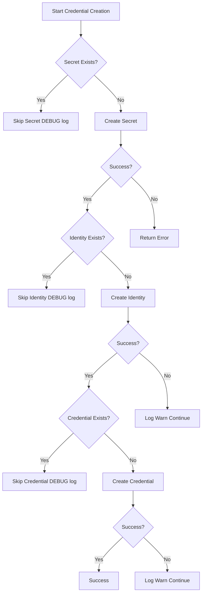

# Feature: Cloud Credentials Support for k0rdentd

## Overview

This feature adds the ability for k0rdentd to automatically create cloud provider credentials for k0rdent during installation. Users can specify credentials for AWS, Azure, and OpenStack in the `k0rdentd.yaml` configuration file, and k0rdentd will create the necessary Kubernetes objects.

## Design Goals

1. **Simple Configuration**: Users can specify credentials in a straightforward YAML structure
2. **Multiple Providers**: Support AWS, Azure, and OpenStack simultaneously
3. **Secure**: Credentials are stored as Kubernetes Secrets
4. **Automatic**: Credentials are created automatically after k0rdent installation
5. **Extensible**: Easy to add new cloud providers in the future
6. **Idempotent**: Credential creation can be run multiple times safely - only creates resources that don't exist

## Configuration Structure

### Proposed k0rdentd.yaml Extension

```yaml
k0s:
  # ... existing k0s config

k0rdent:
  version: "v0.1.0"
  helm:
    chart: "k0rdent/k0rdent"
    namespace: "kcm-system"
  # NEW: Credentials configuration
  credentials:
    aws:
      - name: aws-prod-credentials
        region: us-east-1
        accessKeyID: AKIA...
        secretAccessKey: secret...
        sessionToken: "..."  # Optional: for MFA or SSO authentication
    azure:
      - name: azure-prod-credentials
        subscriptionID: sub-id...
        clientID: client-id...
        clientSecret: secret...
        tenantID: tenant-id...
    openstack:
      - name: openstack-prod-credentials
        authURL: https://auth.example.com:5000/v3
        region: RegionOne
        # Option 1: Application Credentials
        applicationCredentialID: app-cred-id...
        applicationCredentialSecret: app-cred-secret...
        # Option 2: Username/Password (alternative)
        # username: admin
        # password: secret
        # projectName: myproject
        # domainName: default
```

## Kubernetes Objects Created

### AWS

For each AWS credential entry, k0rdentd creates:

1. **Secret** (`v1/Secret`)
   ```yaml
   apiVersion: v1
   kind: Secret
   metadata:
     name: <name>-secret
     namespace: kcm-system
     labels:
       k0rdent.mirantis.com/component: "kcm"
   type: Opaque
   stringData:
     AccessKeyID: <accessKeyID>
     SecretAccessKey: <secretAccessKey>
     SessionToken: <sessionToken>  # Optional: for MFA or SSO authentication
   ```

2. **AWSClusterStaticIdentity** (`infrastructure.cluster.x-k8s.io/v1beta2`)
   ```yaml
   apiVersion: infrastructure.cluster.x-k8s.io/v1beta2
   kind: AWSClusterStaticIdentity
   metadata:
     name: <name>-identity
     namespace: kcm-system
     labels:
       k0rdent.mirantis.com/component: "kcm"
   spec:
     secretRef: <name>-secret
     allowedNamespaces:
       selector:
         matchLabels: {}
   ```

3. **Credential** (`k0rdent.mirantis.com/v1beta1`)
   ```yaml
   apiVersion: k0rdent.mirantis.com/v1beta1
   kind: Credential
   metadata:
     name: <name>
     namespace: kcm-system
     labels:
       k0rdent.mirantis.com/component: "kcm"
   spec:
     description: "AWS credentials for <name>"
     identityRef:
       apiVersion: infrastructure.cluster.x-k8s.io/v1beta2
       kind: AWSClusterStaticIdentity
       name: <name>-identity
       namespace: kcm-system
   ```

### Azure

For each Azure credential entry, k0rdentd creates:

1. **Secret** (`v1/Secret`)
   ```yaml
   apiVersion: v1
   kind: Secret
   metadata:
     name: <name>-secret
     namespace: kcm-system
     labels:
       k0rdent.mirantis.com/component: "kcm"
   type: Opaque
   stringData:
     clientSecret: <clientSecret>
   ```

2. **AzureClusterIdentity** (`infrastructure.cluster.x-k8s.io/v1beta1`)
   ```yaml
   apiVersion: infrastructure.cluster.x-k8s.io/v1beta1
   kind: AzureClusterIdentity
   metadata:
     name: <name>-identity
     namespace: kcm-system
     labels:
       clusterctl.cluster.x-k8s.io/move-hierarchy: "true"
       k0rdent.mirantis.com/component: "kcm"
   spec:
     allowedNamespaces: {}
     clientID: <clientID>
     clientSecret:
       name: <name>-secret
       namespace: kcm-system
     tenantID: <tenantID>
     type: ServicePrincipal
   ```

3. **Credential** (`k0rdent.mirantis.com/v1beta1`)
   ```yaml
   apiVersion: k0rdent.mirantis.com/v1beta1
   kind: Credential
   metadata:
     name: <name>
     namespace: kcm-system
   spec:
     identityRef:
       apiVersion: infrastructure.cluster.x-k8s.io/v1beta1
       kind: AzureClusterIdentity
       name: <name>-identity
       namespace: kcm-system
   ```

### OpenStack

For each OpenStack credential entry, k0rdentd creates:

1. **Secret** (`v1/Secret`) - Contains clouds.yaml
   ```yaml
   apiVersion: v1
   kind: Secret
   metadata:
     name: <name>-config
     namespace: kcm-system
     labels:
       k0rdent.mirantis.com/component: "kcm"
   stringData:
     clouds.yaml: |
       clouds:
         openstack:
           auth:
             auth_url: <authURL>
             application_credential_id: <applicationCredentialID>
             application_credential_secret: <applicationCredentialSecret>
           region_name: <region>
           interface: public
           identity_api_version: 3
           auth_type: v3applicationcredential
   ```

2. **Credential** (`k0rdent.mirantis.com/v1beta1`)
   ```yaml
   apiVersion: k0rdent.mirantis.com/v1beta1
   kind: Credential
   metadata:
     name: <name>
     namespace: k0rdent-system
     labels:
       k0rdent.mirantis.com/component: "kcm"
   spec:
     description: "OpenStack credentials for <name>"
     identityRef:
       apiVersion: v1
       kind: Secret
       name: <name>-config
       namespace: kcm-system
   ```

## Implementation Plan

### 1. Configuration Types (pkg/config/k0rdentd.go)

Add new types for credentials configuration:

```go
// CredentialsConfig holds credentials for all cloud providers
type CredentialsConfig struct {
    AWS       []AWSCredential       `yaml:"aws,omitempty"`
    Azure     []AzureCredential     `yaml:"azure,omitempty"`
    OpenStack []OpenStackCredential `yaml:"openstack,omitempty"`
}

// AWSCredential represents AWS credentials
type AWSCredential struct {
    Name            string `yaml:"name"`
    Region          string `yaml:"region"`
    AccessKeyID     string `yaml:"accessKeyID"`
    SecretAccessKey string `yaml:"secretAccessKey"`
}

// AzureCredential represents Azure Service Principal credentials
type AzureCredential struct {
    Name           string `yaml:"name"`
    SubscriptionID string `yaml:"subscriptionID"`
    ClientID       string `yaml:"clientID"`
    ClientSecret   string `yaml:"clientSecret"`
    TenantID       string `yaml:"tenantID"`
}

// OpenStackCredential represents OpenStack credentials
type OpenStackCredential struct {
    Name                      string `yaml:"name"`
    AuthURL                   string `yaml:"authURL"`
    Region                    string `yaml:"region"`
    ApplicationCredentialID   string `yaml:"applicationCredentialID,omitempty"`
    ApplicationCredentialSecret string `yaml:"applicationCredentialSecret,omitempty"`
    Username                  string `yaml:"username,omitempty"`
    Password                  string `yaml:"password,omitempty"`
    ProjectName               string `yaml:"projectName,omitempty"`
    DomainName                string `yaml:"domainName,omitempty"`
}
```

Update `K0rdentConfig` to include credentials:

```go
type K0rdentConfig struct {
    Version     string            `yaml:"version"`
    Helm        K0rdentHelmConfig `yaml:"helm"`
    Credentials CredentialsConfig `yaml:"credentials,omitempty"`  // NEW
}
```

### 2. Credentials Package (pkg/credentials/)

Create a new package for credential management:

```go
package credentials

import (
    "context"
    "fmt"
    
    "github.com/belgaied2/k0rdentd/pkg/config"
    "github.com/belgaied2/k0rdentd/pkg/k8sclient"
)

// Manager handles creation of cloud provider credentials
type Manager struct {
    client *k8sclient.Client
}

// NewManager creates a new credentials manager
func NewManager(client *k8sclient.Client) *Manager {
    return &Manager{client: client}
}

// CreateAll creates all configured credentials
func (m *Manager) CreateAll(ctx context.Context, cfg config.CredentialsConfig) error {
    // Create AWS credentials
    for _, cred := range cfg.AWS {
        if err := m.createAWSCredentials(ctx, cred); err != nil {
            return fmt.Errorf("failed to create AWS credentials %s: %w", cred.Name, err)
        }
    }
    
    // Create Azure credentials
    for _, cred := range cfg.Azure {
        if err := m.createAzureCredentials(ctx, cred); err != nil {
            return fmt.Errorf("failed to create Azure credentials %s: %w", cred.Name, err)
        }
    }
    
    // Create OpenStack credentials
    for _, cred := range cfg.OpenStack {
        if err := m.createOpenStackCredentials(ctx, cred); err != nil {
            return fmt.Errorf("failed to create OpenStack credentials %s: %w", cred.Name, err)
        }
    }
    
    return nil
}
```

### 3. K8sClient Extensions (pkg/k8sclient/)

Add methods to create custom resources using dynamic client:

```go
// CreateSecret creates a Kubernetes Secret
func (c *Client) CreateSecret(ctx context.Context, secret *corev1.Secret) error

// CreateAWSClusterStaticIdentity creates an AWSClusterStaticIdentity CR
func (c *Client) CreateAWSClusterStaticIdentity(ctx context.Context, name string, secretRef string) error

// CreateAzureClusterIdentity creates an AzureClusterIdentity CR
func (c *Client) CreateAzureClusterIdentity(ctx context.Context, name, clientID, tenantID, secretName string) error

// CreateCredential creates a k0rdent Credential CR
func (c *Client) CreateCredential(ctx context.Context, name, description, identityKind, identityName string) error
```

### 4. Installer Integration (pkg/installer/installer.go)

Update the installer to create credentials after k0rdent is installed:

```go
func (i *Installer) Install(k0sConfig []byte, k0rdentConfig *config.K0rdentConfig) error {
    // ... existing installation steps ...
    
    // Wait for k0rdent Helm chart to be installed
    if err := i.waitForK0rdentInstalled(); err != nil {
        return fmt.Errorf("k0rdent Helm chart failed to install: %w", err)
    }
    
    // NEW: Create credentials if configured
    if hasCredentials(k0rdentConfig.Credentials) {
        utils.GetLogger().Info("Creating cloud provider credentials...")
        credManager := credentials.NewManager(i.k8sClient)
        if err := credManager.CreateAll(context.Background(), k0rdentConfig.Credentials); err != nil {
            return fmt.Errorf("failed to create credentials: %w", err)
        }
        utils.GetLogger().Info("✅ Cloud provider credentials created successfully")
    }
    
    return nil
}
```

### 5. CLI Updates (pkg/cli/install.go)

Pass the full k0rdent config to the installer:

```go
func installAction(c *cli.Context) error {
    // ... existing code ...
    
    if err := installer.Install(k0sConfig, &cfg.K0rdent); err != nil {
        return fmt.Errorf("installation failed: %w", err)
    }
    
    // ... rest of the code ...
}
```

## Security Considerations

1. **Secret Storage**: All sensitive data is stored in Kubernetes Secrets
2. **No Logging**: Credential values are never logged
3. **Namespace Isolation**: Credentials are created in the k0rdent namespace (kcm-system)
4. **Allowed Namespaces**: Identity objects use `allowedNamespaces` to control access

## Idempotent Implementation

The credential creation system is designed to be fully idempotent, allowing it to be run multiple times safely.

### Per-Resource Idempotency

Each resource (Secret, Identity, Credential) is checked individually before creation:

1. **Existence Check**: Before creating any resource, the system checks if it already exists
2. **Skip if Exists**: If a resource exists, it is skipped (logged at DEBUG level) and no API calls are made
3. **Create if Missing**: If a resource doesn't exist, it is created

### Benefits

- **Partial State Recovery**: If a previous run was interrupted (e.g., Secret created but Identity failed), the next run will skip the existing Secret and create the missing Identity
- **Reduced API Calls**: Existing resources are not retrieved or updated, minimizing unnecessary API traffic
- **Safe Re-runs**: The entire credential creation process can be safely re-run without causing conflicts or duplicate resources

### Error Handling Strategy

The system implements a "best effort" error handling strategy:

- **Secret Creation**: If Secret creation fails, the entire credential creation fails (critical component)
- **Identity/Credential Creation**: If Identity or Credential creation fails, a warning is logged but the process continues
- This approach allows partial failures to be recovered in subsequent runs

### Example Flow



## Testing Strategy

1. **Unit Tests**: Test credential generation logic with fake k8s client
2. **Idempotency Tests**: Verify that running credential creation twice produces the same result
3. **Partial Failure Tests**: Verify system handles partial state correctly
4. **Validation Tests**: Test configuration parsing and validation
5. **Integration Tests**: Test credential creation against a real k0s cluster

## Future Enhancements

1. **Credential Rotation**: Support for rotating credentials without recreating
2. **External Secrets**: Integration with external secret management systems (Vault, etc.)
3. **Additional Providers**: vSphere, GCP, and other cloud providers
4. **Credential Validation**: Validate credentials by making API calls to cloud providers
