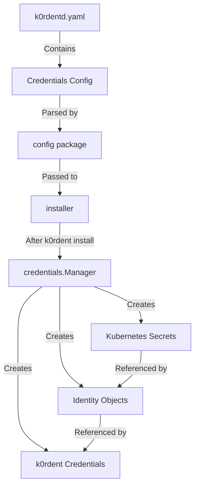

# Implementation Plan: Cloud Credentials Support

## Overview

This document outlines the implementation plan for adding cloud provider credentials support to k0rdentd. The feature allows users to specify AWS, Azure, and OpenStack credentials in the `k0rdentd.yaml` configuration file, which will then be automatically created as Kubernetes objects after k0rdent installation.

## Architecture



## Files to Modify/Create

### 1. Configuration (pkg/config/k0rdentd.go)

**Changes:**
- Add `CredentialsConfig` struct
- Add `AWSCredential`, `AzureCredential`, `OpenStackCredential` structs
- Update `K0rdentConfig` to include `Credentials` field

**New Types:**
```go
// CredentialsConfig holds credentials for all cloud providers
type CredentialsConfig struct {
    AWS       []AWSCredential       `yaml:"aws,omitempty"`
    Azure     []AzureCredential     `yaml:"azure,omitempty"`
    OpenStack []OpenStackCredential `yaml:"openstack,omitempty"`
}

// AWSCredential represents AWS credentials
type AWSCredential struct {
    Name            string `yaml:"name"`
    Region          string `yaml:"region"`
    AccessKeyID     string `yaml:"accessKeyID"`
    SecretAccessKey string `yaml:"secretAccessKey"`
    SessionToken    string `yaml:"sessionToken,omitempty"` // Optional: for MFA or SSO
}

// AzureCredential represents Azure Service Principal credentials
type AzureCredential struct {
    Name           string `yaml:"name"`
    SubscriptionID string `yaml:"subscriptionID"`
    ClientID       string `yaml:"clientID"`
    ClientSecret   string `yaml:"clientSecret"`
    TenantID       string `yaml:"tenantID"`
}

// OpenStackCredential represents OpenStack credentials
type OpenStackCredential struct {
    Name                        string `yaml:"name"`
    AuthURL                     string `yaml:"authURL"`
    Region                      string `yaml:"region"`
    ApplicationCredentialID     string `yaml:"applicationCredentialID,omitempty"`
    ApplicationCredentialSecret string `yaml:"applicationCredentialSecret,omitempty"`
    Username                    string `yaml:"username,omitempty"`
    Password                    string `yaml:"password,omitempty"`
    ProjectName                 string `yaml:"projectName,omitempty"`
    DomainName                  string `yaml:"domainName,omitempty"`
}
```

### 2. Credentials Package (pkg/credentials/credentials.go) - NEW FILE

**Purpose:** Handle creation of cloud provider credentials

**Key Functions:**
- `NewManager(client *k8sclient.Client) *Manager`
- `CreateAll(ctx context.Context, cfg config.CredentialsConfig) error`
- `createAWSCredentials(ctx context.Context, cred config.AWSCredential) error`
- `createAzureCredentials(ctx context.Context, cred config.AzureCredential) error`
- `createOpenStackCredentials(ctx context.Context, cred config.OpenStackCredential) error`

### 3. K8sClient Extensions (pkg/k8sclient/client.go)

**New Methods:**
- `CreateSecret(ctx context.Context, secret *corev1.Secret) error`
- `CreateAWSClusterStaticIdentity(ctx context.Context, name, secretRef, namespace string) error`
- `CreateAzureClusterIdentity(ctx context.Context, name, clientID, tenantID, secretName, namespace string) error`
- `CreateCredential(ctx context.Context, name, description, identityKind, identityName, identityAPIVersion, namespace string) error`

**Note:** For custom resources (AWSClusterStaticIdentity, AzureClusterIdentity, Credential), use the dynamic client from `k8s.io/client-go/dynamic`.

### 4. Installer Updates (pkg/installer/installer.go)

**Changes:**
- Modify `Install` function signature to accept `*config.K0rdentConfig`
- Add credential creation step after k0rdent installation
- Add `hasCredentials()` helper function

**New Code:**
```go
func (i *Installer) Install(k0sConfig []byte, k0rdentConfig *config.K0rdentConfig) error {
    // ... existing installation steps ...
    
    // Create credentials if configured
    if i.hasCredentials(k0rdentConfig.Credentials) {
        utils.GetLogger().Info("Creating cloud provider credentials...")
        credManager := credentials.NewManager(i.k8sClient)
        if err := credManager.CreateAll(context.Background(), k0rdentConfig.Credentials); err != nil {
            return fmt.Errorf("failed to create credentials: %w", err)
        }
        utils.GetLogger().Info("✅ Cloud provider credentials created successfully")
    }
    
    return nil
}

func (i *Installer) hasCredentials(cfg config.CredentialsConfig) bool {
    return len(cfg.AWS) > 0 || len(cfg.Azure) > 0 || len(cfg.OpenStack) > 0
}
```

### 5. CLI Updates (pkg/cli/install.go)

**Changes:**
- Pass `&cfg.K0rdent` to `installer.Install()` instead of just the k0s config

### 6. Example Configuration (examples/k0rdentd.yaml)

**Add:**
```yaml
k0rdent:
  # ... existing config ...
  credentials:
    aws:
      - name: aws-prod-credentials
        region: us-east-1
        accessKeyID: "AKIA..."
        secretAccessKey: "secret..."
        sessionToken: "..."  # Optional: for MFA or SSO authentication
    azure:
      - name: azure-prod-credentials
        subscriptionID: "..."
        clientID: "..."
        clientSecret: "..."
        tenantID: "..."
    openstack:
      - name: openstack-prod-credentials
        authURL: "https://..."
        region: "RegionOne"
        applicationCredentialID: "..."
        applicationCredentialSecret: "..."
```

### 7. Unit Tests

**Files to Create:**
- `pkg/credentials/credentials_test.go` - Test credential creation logic
- `pkg/config/config_test.go` - Update to test credentials parsing

**Test Cases:**
- Parse credentials from YAML
- Create AWS credentials (Secret + Identity + Credential)
- Create Azure credentials (Secret + Identity + Credential)
- Create OpenStack credentials (Secret + Credential)
- Error handling for invalid credentials

## Implementation Order

1. **Update config types** - Add CredentialsConfig structs
2. **Extend k8sclient** - Add methods for creating custom resources
3. **Create credentials package** - Implement credential creation logic
4. **Update installer** - Integrate credentials creation into install flow
5. **Update CLI** - Pass k0rdent config to installer
6. **Update examples** - Add credentials examples
7. **Write tests** - Unit tests for all new code

## Security Considerations

1. Credentials are stored as Kubernetes Secrets
2. Sensitive values are never logged
3. Credentials are created in the k0rdent namespace (kcm-system)
4. Identity objects use `allowedNamespaces` to control access

## Dependencies

No new external dependencies required. Uses existing:
- `k8s.io/client-go/kubernetes`
- `k8s.io/client-go/dynamic` (for custom resources)
- `k8s.io/api/core/v1` (for Secrets)
