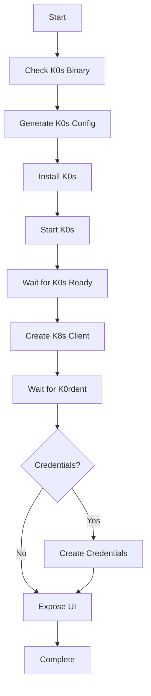
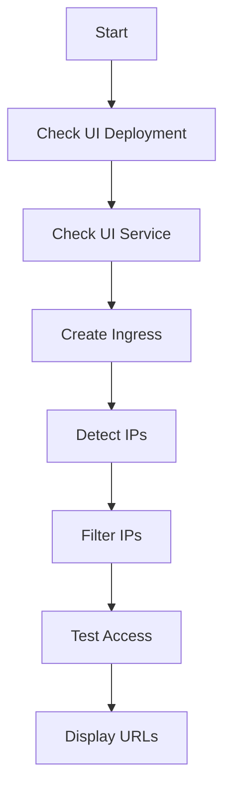

# Components

This document describes the key components of K0rdentd in detail.

## CLI Package (`pkg/cli`)

The CLI package implements all command-line commands using urfave/cli.

### Commands

| Command | File | Description |
|---------|------|-------------|
| `install` | `install.go` | Install K0s and K0rdent |
| `uninstall` | `uninstall.go` | Uninstall K0s and K0rdent |
| `version` | `version.go` | Show version information |
| `config` | `config.go` | Manage configuration |
| `expose-ui` | `expose_ui.go` | Expose K0rdent UI |
| `registry` | `registry.go` | Start OCI registry daemon |
| `export-worker-artifacts` | `export_worker.go` | Export worker artifacts |
| `show-flavor` | `show_flavor.go` | Show build flavor |

### CLI Flags

| Flag | Description |
|------|-------------|
| `--config-file` | Path to config file (default: /etc/k0rdentd/k0rdentd.yaml) |
| `--debug` | Enable debug logging |
| `--dry-run` | Show what would be done without making changes |

## Config Package (`pkg/config`)

The config package handles configuration parsing and validation.

### Configuration Types

```go
// K0rdentdConfig represents the complete k0rdentd configuration
type K0rdentdConfig struct {
    K0s      K0sConfig      `yaml:"k0s"`
    K0rdent  K0rdentConfig  `yaml:"k0rdent"`
    Airgap   AirgapConfig   `yaml:"airgap,omitempty"`
    Debug    bool           `yaml:"debug"`
    LogLevel string         `yaml:"logLevel"`
}

// K0sConfig represents K0s-specific configuration
type K0sConfig struct {
    Version string         `yaml:"version"`
    API     APIConfig      `yaml:"api"`
    Network NetworkConfig  `yaml:"network"`
    Storage StorageConfig  `yaml:"storage"`
}

// K0rdentConfig represents K0rdent-specific configuration
type K0rdentConfig struct {
    Version     string              `yaml:"version"`
    Helm        K0rdentHelmConfig   `yaml:"helm"`
    Credentials CredentialsConfig   `yaml:"credentials,omitempty"`
}
```

### Validation

The config package validates:

- Required fields are present
- Version formats are correct
- Network CIDRs are valid
- File paths exist

## Generator Package (`pkg/generator`)

The generator package generates K0s configuration from k0rdentd configuration.

### K0s Configuration Generation

```go
// GenerateK0sConfig generates k0s.yaml from k0rdentd configuration
func GenerateK0sConfig(cfg *config.K0rdentdConfig) ([]byte, error)
```

The generator:

1. Reads k0rdentd.yaml configuration
2. Maps configuration to K0s format
3. Adds Helm extension for K0rdent
4. Generates valid k0s.yaml

## Installer Package (`pkg/installer`)

The installer package handles the installation workflow.

### Installation Steps



### Key Methods

| Method | Description |
|--------|-------------|
| `Install()` | Main installation entry point |
| `installK0s()` | Install K0s binary |
| `generateK0sConfig()` | Generate K0s configuration |
| `waitForK0sReady()` | Wait for K0s to be ready |
| `waitForK0rdentInstalled()` | Wait for K0rdent pods |
| `createCredentials()` | Create cloud credentials |

## K8sClient Package (`pkg/k8sclient`)

The k8sclient package provides a Kubernetes client wrapper.

### Client Structure

```go
// Client wraps a Kubernetes clientset with helper methods
type Client struct {
    clientset     kubernetes.Interface
    dynamicClient dynamic.Interface
    config        *rest.Config
}
```

### Key Methods

| Method | Description |
|--------|-------------|
| `NewFromK0s()` | Create client from K0s kubeconfig |
| `NewFromKubeconfig()` | Create client from kubeconfig bytes |
| `NamespaceExists()` | Check namespace existence |
| `GetDeploymentReadyReplicas()` | Get ready replicas |
| `GetPodPhases()` | Get pod phases |
| `PatchServiceType()` | Patch service type |
| `ApplyIngress()` | Create/update ingress |
| `CreateSecret()` | Create Kubernetes secret |
| `CreateAWSClusterStaticIdentity()` | Create AWS identity |
| `CreateAzureClusterIdentity()` | Create Azure identity |
| `CreateCredential()` | Create K0rdent credential |

## Credentials Package (`pkg/credentials`)

The credentials package manages cloud provider credentials.

### Manager Structure

```go
// Manager handles creation of cloud provider credentials
type Manager struct {
    client *k8sclient.Client
}

// NewManager creates a new credentials manager
func NewManager(client *k8sclient.Client) *Manager
```

### Supported Providers

#### AWS

Creates:

1. **Secret** with AWS credentials
2. **AWSClusterStaticIdentity** for CAPI
3. **Credential** for K0rdent

#### Azure

Creates:

1. **Secret** with Azure credentials
2. **AzureClusterIdentity** for CAPI
3. **Credential** for K0rdent

#### OpenStack

Creates:

1. **Secret** with clouds.yaml
2. **Credential** for K0rdent

### Idempotency

The credentials package implements idempotent resource creation:

```go
// createIfNotExists checks for resource existence before creation
func (m *Manager) createIfNotExists(
    ctx context.Context,
    spec ResourceSpec,
    existsFn ExistsFunc,
    createFn CreateFunc,
) error
```

## K0s Package (`pkg/k0s`)

The k0s package manages the K0s binary.

### Checker

```go
// CheckResult contains the result of a K0s check
type CheckResult struct {
    Installed bool
    Version   string
    Path      string
}

// CheckK0s checks if K0s is installed and returns its version
func CheckK0s() (CheckResult, error)

// InstallK0s installs K0s using the official install script
func InstallK0s() error
```

## UI Package (`pkg/ui`)

The UI package handles exposing the K0rdent UI.

### ExposeUI Flow



### IP Detection

The UI package detects IPs from:

1. Network interfaces (excluding Calico, Docker)
2. Cloud metadata services (AWS, Azure, GCP)
3. VPN interfaces (Tailscale, etc.)

## Airgap Package (`internal/airgap`)

The airgap package handles airgap-specific functionality.

### Detector

```go
// Build flavor detection
var Flavor = "online"     // or "airgap"
var K0sVersion = ""       // Set at build time

func IsAirGap() bool {
    return Flavor == "airgap"
}
```

### Assets

```go
//go:embed k0s/*
var K0sBinary embed.FS

//go:embed skopeo/*
var SkopeoBinary embed.FS
```

### Registry Daemon

```go
// RegistryDaemon manages the local OCI registry
type RegistryDaemon struct {
    port       string
    host       string
    storageDir string
    bundlePath string
    server     *http.Server
}

func (r *RegistryDaemon) Start(ctx context.Context) error
```

### Containerd Configuration

```go
// SetupContainerdMirror configures containerd to use local registry
func SetupContainerdMirror(mirrorAddr string) error
```

## Utils Package (`pkg/utils`)

The utils package provides utility functions.

### Logging

```go
// GetLogger returns the configured logrus logger
func GetLogger() *logrus.Logger
```

### Spinner

```go
// Spinner displays a waiting spinner
type Spinner struct {
    message string
    active  bool
}

func NewSpinner(message string) *Spinner
func (s *Spinner) Start()
func (s *Spinner) Stop()
```

## Testing Strategy

### Unit Tests

- Use ginkgo/gomega framework
- Mock external dependencies
- Test all business logic

### Test Coverage

- Maintain >80% code coverage
- Use fake clientset for K8sClient tests
- Mock exec commands for binary tests

### Integration Tests

- Test with real K0s cluster
- Verify end-to-end installation
- Test upgrade scenarios
