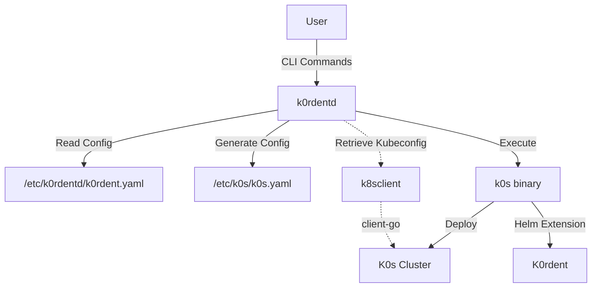

# Architecture Overview

K0rdentd is a CLI tool that automates the deployment of K0s and K0rdent on a VM. It follows a similar pattern to RancherD but simplifies the architecture by directly configuring K0s and using its built-in Helm extension mechanism.

## High-Level Architecture



## Core Components

### 1. CLI Interface

The CLI is built using [urfave/cli](https://github.com/urfave/cli) and provides the following commands:

| Command | Description |
|---------|-------------|
| `k0rdentd install` | Install K0s and K0rdent |
| `k0rdentd uninstall` | Uninstall K0s and K0rdent |
| `k0rdentd version` | Show version information |
| `k0rdentd config` | Manage configuration |
| `k0rdentd expose-ui` | Expose K0rdent UI |
| `k0rdentd registry` | Start OCI registry daemon |
| `k0rdentd export-worker-artifacts` | Export artifacts for worker nodes |
| `k0rdentd show-flavor` | Show build flavor |

### 2. Configuration Management

K0rdentd reads configuration from `/etc/k0rdentd/k0rdentd.yaml` and generates:

- K0s configuration at `/etc/k0s/k0s.yaml`
- Containerd configuration for airgap mode
- Helm values for K0rdent deployment

### 3. K0s Binary Management

K0rdentd manages the K0s binary:

- **Online mode**: Downloads from official sources
- **Airgap mode**: Extracts from embedded binary

### 4. Kubernetes Client

Uses [client-go](https://github.com/kubernetes/client-go) to interact with the cluster:

- No dependency on kubectl binary
- Type-safe API operations
- Better error handling

### 5. Credentials Management

Creates cloud provider credentials for K0rdent:

- AWS: Secret + AWSClusterStaticIdentity + Credential
- Azure: Secret + AzureClusterIdentity + Credential
- OpenStack: Secret + Credential

### 6. Airgap Support

Full offline installation support:

- Embedded K0s binary
- Local OCI registry daemon
- Containerd mirror configuration

## Design Principles

### Simplicity

- Single binary deployment
- Minimal external dependencies
- Clear configuration structure

### Security

- No secrets in logs
- Credentials stored in Kubernetes Secrets
- File permissions enforced

### Reliability

- Idempotent operations
- Graceful error handling
- Comprehensive logging

## Directory Structure

```
.
├── cmd/
│   └── k0rdentd/
│       └── main.go          # CLI entry point
├── pkg/
│   ├── cli/                # CLI command implementations
│   ├── config/             # Configuration management
│   ├── generator/          # K0s config generation
│   ├── installer/          # Installation logic
│   ├── credentials/        # Cloud provider credentials
│   ├── k8sclient/          # Kubernetes client-go wrapper
│   ├── k0s/                # K0s binary management
│   ├── ui/                 # UI exposure functionality
│   └── utils/              # Utility functions
├── internal/
│   ├── airgap/             # Airgap-specific code
│   │   ├── assets/         # Embedded assets
│   │   ├── registry/       # OCI registry daemon
│   │   ├── containerd/     # Containerd configuration
│   │   └── bundle/         # Bundle handling
│   └── test/               # Test utilities
├── scripts/                # Build and deployment scripts
├── docs/                   # Documentation
└── examples/               # Example configurations
```

## Next Steps

- [System Design](system-design.md) - Detailed system design
- [Components](components.md) - Component documentation
