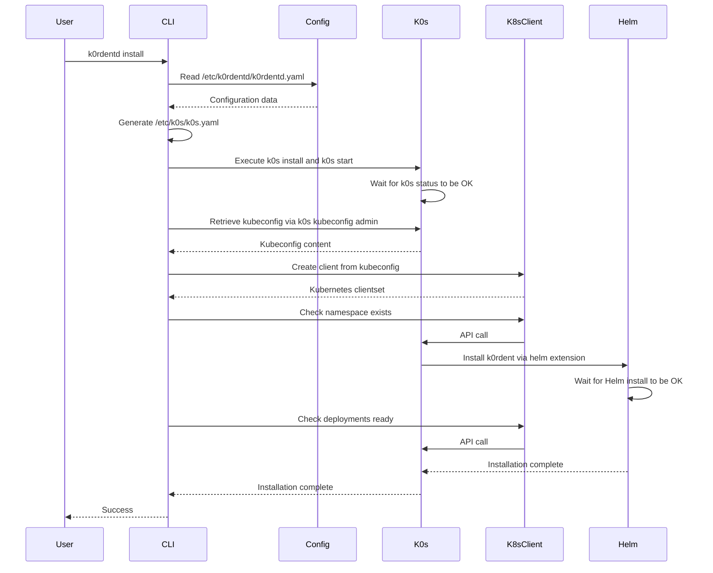
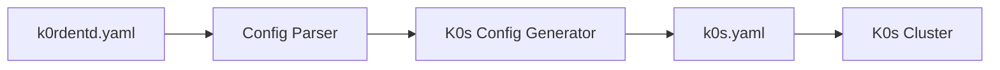
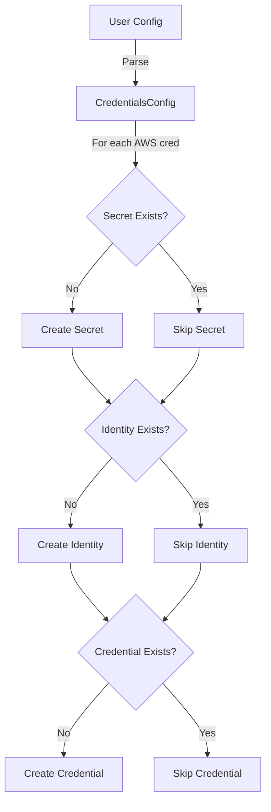
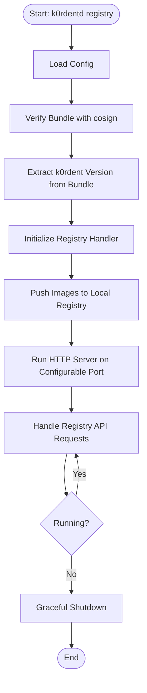

# System Design

This document describes the detailed system design of K0rdentd.

## Installation Workflow



## Configuration Flow

### K0rdentd Configuration to K0s Configuration

K0rdentd translates the user-friendly configuration in `/etc/k0rdentd/k0rdentd.yaml` to K0s-specific configuration at `/etc/k0s/k0s.yaml`:



### Configuration Mapping

| k0rdentd.yaml | k0s.yaml |
|---------------|----------|
| `k0s.api.address` | `spec.api.address` |
| `k0s.api.port` | `spec.api.port` |
| `k0s.network.provider` | `spec.network.provider` |
| `k0s.network.podCIDR` | `spec.network.podCIDR` |
| `k0s.network.serviceCIDR` | `spec.network.serviceCIDR` |
| `k0s.storage.type` | `spec.storage.type` |
| `k0rdent.version` | `spec.extensions.helm.charts[].version` |
| `k0rdent.helm.values` | `spec.extensions.helm.charts[].values` |

## Kubernetes Client Architecture

### K8sClient Package

The `k8sclient` package provides a Go-native way to interact with the Kubernetes cluster using the official `client-go` library.

```go
// Client wraps a Kubernetes clientset with helper methods
type Client struct {
    clientset kubernetes.Interface
    config    *rest.Config
}
```

### Kubeconfig Retrieval

1. After K0s installation, retrieve admin kubeconfig via `k0s kubeconfig admin`
2. Keep kubeconfig in memory (not written to disk) for security
3. Create client-go clientset using `clientcmd.RESTConfigFromKubeConfig()`

### Provided Operations

| Method | Description |
|--------|-------------|
| `NamespaceExists(name)` | Check if namespace exists |
| `GetDeploymentReadyReplicas(ns, name)` | Get ready replica count |
| `GetDeploymentReplicas(ns, name)` | Get total replica count |
| `GetPodPhases(ns, selector)` | Get pod phases by selector |
| `PatchServiceType(ns, name, type)` | Patch service type |
| `GetServiceNodePort(ns, name)` | Get service NodePort |
| `ApplyIngress(ingress)` | Create or update ingress |
| `GetDeploymentEnvVar(ns, dep, container, env)` | Extract env var |

### Benefits

- Type-safe API operations instead of jsonpath parsing
- Better error handling using `k8s.io/apimachinery/pkg/api/errors`
- No dependency on kubectl binary
- Easier to mock for testing using fake clientset

## Credentials Package Architecture

### Manager Structure

```go
// Manager handles creation of cloud provider credentials
type Manager struct {
    client *k8sclient.Client
}
```

### Credential Creation Flow



### Idempotent Resource Creation

The `createIfNotExists` function provides idempotent operations:

```go
// ResourceSpec defines the specification of a resource to be created
type ResourceSpec struct {
    Type      ResourceType
    Namespace string
    Name      string
}

// createIfNotExists checks for resource existence before creation
func (m *Manager) createIfNotExists(
    ctx context.Context,
    spec ResourceSpec,
    existsFn ExistsFunc,
    createFn CreateFunc,
) error
```

### Error Handling Strategy

- **Best effort approach**: Secret creation failures return errors
- **Graceful degradation**: Identity/Credential failures only log warnings
- **Partial state recovery**: Can recover from interrupted runs

## Airgap Architecture

### Component Diagram

```
┌─────────────────────────────────────────────────────────────────────────────┐
│                           Air-Gapped k0rdentd                               │
│                                Binary                                        │
├─────────────────────────────────────────────────────────────────────────────┤
│  ┌──────────────┐  ┌─────────────────────────────────────────────────┐     │
│  │   k0s Binary │  │              Build Metadata                     │     │
│  │   (embedded) │  │  { "flavor": "airgap", "k0sVersion": "v1.32.8" }│     │
│  │  ~100 MB     │  │                                               │     │
│  └──────────────┘  └─────────────────────────────────────────────────┘     │
│                                                                              │
│  External: k0rdent Enterprise Airgap Bundle (22 GB)                          │
│  Source: https://get.mirantis.com/k0rdent-enterprise/VERSION/               │
└─────────────────────────────────────────────────────────────────────────────┘
                                   │
                                   ▼
                     ┌─────────────────────────────┐
                     │   k0rdentd registry daemon   │
                     │   (Separate Process)         │
                     │   Port: 5000 (configurable)  │
                     │   Storage: /var/lib/registry │
                     └─────────────────────────────┘
```

### Registry Daemon Lifecycle



### Containerd Mirror Configuration

For airgap mode, containerd is configured to use the local registry:

```
/etc/k0s/
├── k0s.yaml                           # k0s cluster configuration
└── containerd.d/                      # Drop-in configuration directory
    ├── cri-registry.toml              # Containerd CRI registry config
    └── certs.d/                       # Registry hosts configuration
        ├── registry.k8s.io/
        │   └── hosts.toml             # Mirror config for registry.k8s.io
        └── quay.io/
            └── hosts.toml             # Mirror config for quay.io
```

## Security Considerations

### Input Validation

- All user inputs and configuration values are validated
- File paths are sanitized
- Network addresses are validated

### Sensitive Data Handling

- No secrets or API keys are committed to the repository
- Credentials are never logged
- Kubeconfig is kept in memory, not written to disk

### File Permissions

- Configuration files have appropriate permissions (600)
- K0s binary is installed with correct permissions
- Registry storage is protected

## Error Handling

### Validation

- Configuration file structure and values
- Required dependencies (k0s binary, helm, etc.)
- File existence and permissions

### Error Messages

- Meaningful error messages with context
- Suggestions for remediation
- Debug logging for troubleshooting

### Dry-Run Mode

- Test configuration without making changes
- Show what would be done
- Validate all inputs

## Next Steps

- [Components](components.md) - Detailed component documentation
