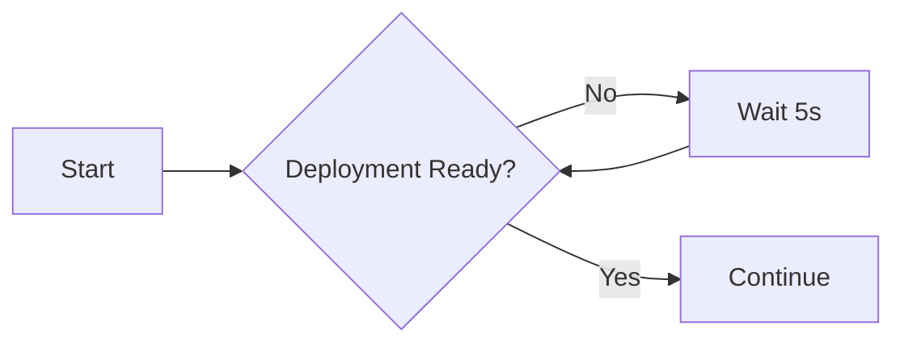

# Exposing the K0rdent UI

K0rdentd can automatically expose the K0rdent UI and provide access URLs. This guide explains how to use the `expose-ui` command and what it does.

## Overview

The `expose-ui` command:

1. Waits for the K0rdent UI deployment to be ready
2. Creates an ingress to expose the UI
3. Detects VM IP addresses
4. Tests UI accessibility
5. Displays access URLs

## Usage

### Automatic Exposure (During Install)

The UI is automatically exposed during `k0rdentd install`. You'll see output like:

```
✓ K0rdent UI is ready
Access the K0rdent UI at:
  http://192.168.1.10/k0rdent-ui
  http://10.0.0.5/k0rdent-ui
```

### Manual Exposure

To expose the UI manually:

```bash
sudo k0rdentd expose-ui
```

### Command Options

```bash
# Custom timeout (default: 5m)
sudo k0rdentd expose-ui --timeout 10m

# Custom ingress path (default: /k0rdent-ui)
sudo k0rdentd expose-ui --path /ui

# Debug mode
sudo k0rdentd expose-ui --debug
```

## How It Works

### Step 1: Wait for UI Deployment

The command waits for the `k0rdent-k0rdent-ui` deployment to be ready:



### Step 2: Create Ingress

Creates an ingress object to expose the UI:

```yaml
apiVersion: networking.k8s.io/v1
kind: Ingress
metadata:
  name: k0rdent-ui
  namespace: kcm-system
spec:
  rules:
    - http:
        paths:
          - path: /k0rdent-ui
            pathType: Prefix
            backend:
              service:
                name: k0rdent-k0rdent-ui
                port:
                  number: 80
```

### Step 3: Detect IP Addresses

The command detects IP addresses from multiple sources:

1. **Network Interfaces**: Parses `ip addr` output
2. **Cloud Metadata**: Queries cloud provider metadata services
3. **VPN Interfaces**: Includes VPN addresses (Tailscale, etc.)

#### Filtering

The following interfaces are excluded:

- Calico interfaces (`cali*`, `vxlan.calico`)
- Docker interfaces (`docker*`, `br-*`)
- Loopback (`lo`)
- Internal Kubernetes interfaces

#### Cloud Provider Detection

| Provider | Detection Method | Metadata URL |
|----------|-----------------|--------------|
| AWS | BIOS vendor check | `http://169.254.169.254/latest/meta-data/` |
| Azure | BIOS vendor check | `http://169.254.169.254/metadata/instance?api-version=2021-02-01` |
| GCP | BIOS vendor check | `http://metadata.google.internal/computeMetadata/v1/instance/` |

### Step 4: Test Accessibility

The command tests if the UI is accessible on each detected IP:

```bash
curl -s -o /dev/null -w "%{http_code}" http://IP/k0rdent-ui
```

Only IPs that return a valid HTTP response are displayed.

### Step 5: Display URLs

Finally, the command displays all valid access URLs:

```
✓ K0rdent UI is accessible at:
  http://192.168.1.10/k0rdent-ui
  http://10.0.0.5/k0rdent-ui

For remote access, use SSH port forwarding:
  ssh -L 8080:localhost:NODEPORT user@host
```

## Access Methods

### Direct Access

If the VM has a publicly accessible IP:

```
http://PUBLIC_IP/k0rdent-ui
```

### NodePort Access

If ingress is not available, use NodePort:

```bash
# Get NodePort
NODEPORT=$(sudo k0s kubectl get svc -n kcm-system k0rdent-k0rdent-ui -o jsonpath='{.spec.ports[0].nodePort}')

# Access
http://IP:NODEPORT
```

### SSH Port Forwarding

For secure remote access:

```bash
# Get NodePort
NODEPORT=$(sudo k0s kubectl get svc -n kcm-system k0rdent-k0rdent-ui -o jsonpath='{.spec.ports[0].nodePort}')

# Create tunnel
ssh -L 8080:localhost:$NODEPORT user@host

# Access
http://localhost:8080/k0rdent-ui
```

### Port Forwarding with kubectl

Alternative using kubectl port-forward:

```bash
# Port forward
sudo k0s kubectl port-forward -n kcm-system svc/k0rdent-k0rdent-ui 8080:80

# Access
http://localhost:8080/k0rdent-ui
```

## Troubleshooting

### UI Not Ready

**Symptom**: Timeout waiting for UI deployment.

**Solution**: Check deployment status:

```bash
# Check deployment
sudo k0s kubectl get deployment -n kcm-system k0rdent-k0rdent-ui

# Check pods
sudo k0s kubectl get pods -n kcm-system -l app.kubernetes.io/name=k0rdent-ui

# Check logs
sudo k0s kubectl logs -n kcm-system -l app.kubernetes.io/name=k0rdent-ui
```

### Ingress Not Working

**Symptom**: Ingress created but UI not accessible.

**Solution**: Check ingress controller:

```bash
# Check ingress
sudo k0s kubectl get ingress -n kcm-system

# Check ingress controller
sudo k0s kubectl get pods -A | grep ingress

# Check ingress logs
sudo k0s kubectl logs -n ingress-nginx -l app.kubernetes.io/name=ingress-nginx
```

### No IP Addresses Found

**Symptom**: No IPs detected or all filtered out.

**Solution**: Check network interfaces:

```bash
# List interfaces
ip addr

# Check for valid interfaces
ip addr | grep -E "inet " | grep -v "127.0.0.1"
```

### UI Returns 404

**Symptom**: HTTP 404 when accessing UI.

**Solution**: Check ingress path:

```bash
# Check ingress path
sudo k0s kubectl get ingress -n kcm-system k0rdent-ui -o yaml

# Verify service
sudo k0s kubectl get svc -n kcm-system k0rdent-k0rdent-ui
```

## Manual Ingress Creation

If automatic exposure fails, create ingress manually:

```yaml
apiVersion: networking.k8s.io/v1
kind: Ingress
metadata:
  name: k0rdent-ui
  namespace: kcm-system
  annotations:
    nginx.ingress.kubernetes.io/rewrite-target: /
spec:
  rules:
    - http:
        paths:
          - path: /k0rdent-ui
            pathType: Prefix
            backend:
              service:
                name: k0rdent-k0rdent-ui
                port:
                  number: 80
```

Apply with:

```bash
sudo k0s kubectl apply -f ingress.yaml
```

## Security Considerations

### Production Deployments

For production, consider:

1. **TLS/HTTPS**: Add TLS configuration to ingress
2. **Authentication**: Add authentication annotations
3. **Network Policies**: Restrict access with network policies

### TLS Example

```yaml
apiVersion: networking.k8s.io/v1
kind: Ingress
metadata:
  name: k0rdent-ui
  namespace: kcm-system
  annotations:
    cert-manager.io/cluster-issuer: letsencrypt-prod
spec:
  tls:
    - hosts:
        - k0rdent.example.com
      secretName: k0rdent-ui-tls
  rules:
    - host: k0rdent.example.com
      http:
        paths:
          - path: /
            pathType: Prefix
            backend:
              service:
                name: k0rdent-k0rdent-ui
                port:
                  number: 80
```

## References

- [K0rdent UI Documentation](https://docs.k0rdent.io)
- [Kubernetes Ingress](https://kubernetes.io/docs/concepts/services-networking/ingress/)
- [NGINX Ingress Controller](https://kubernetes.github.io/ingress-nginx/)
